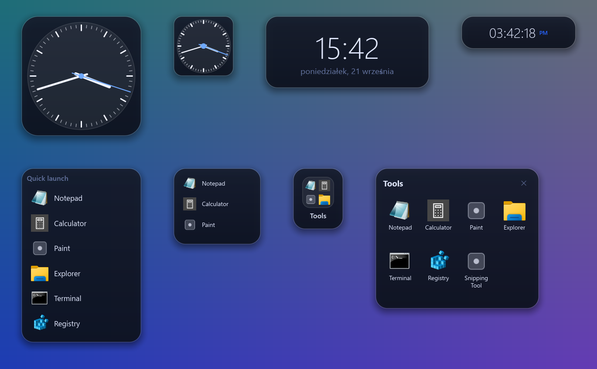
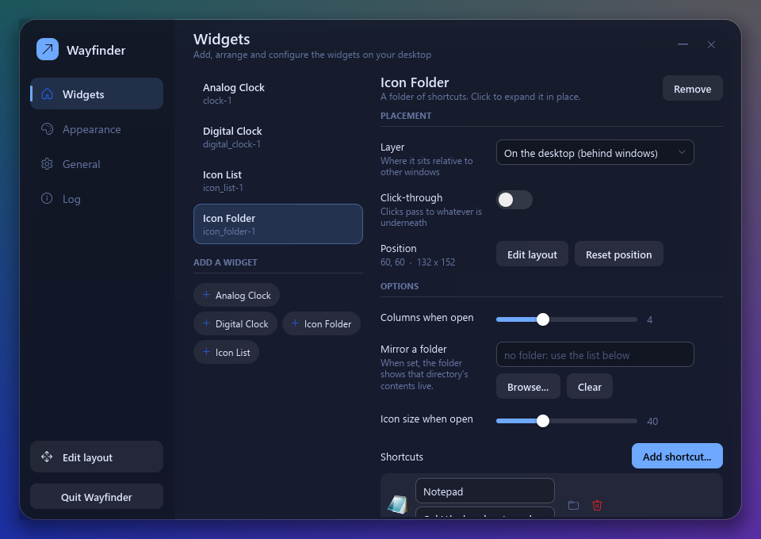
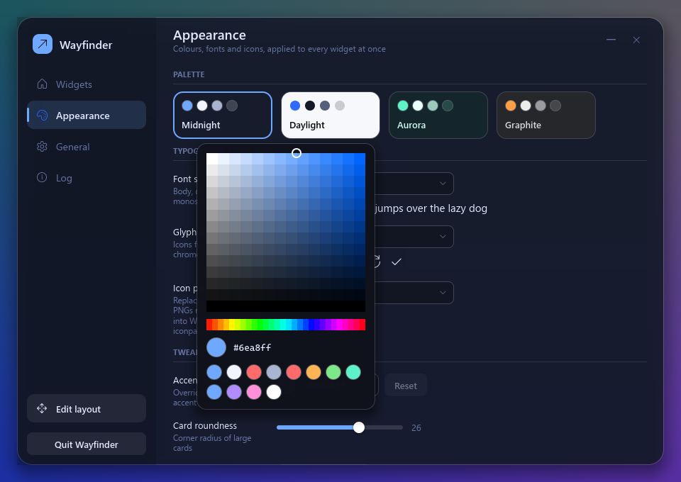
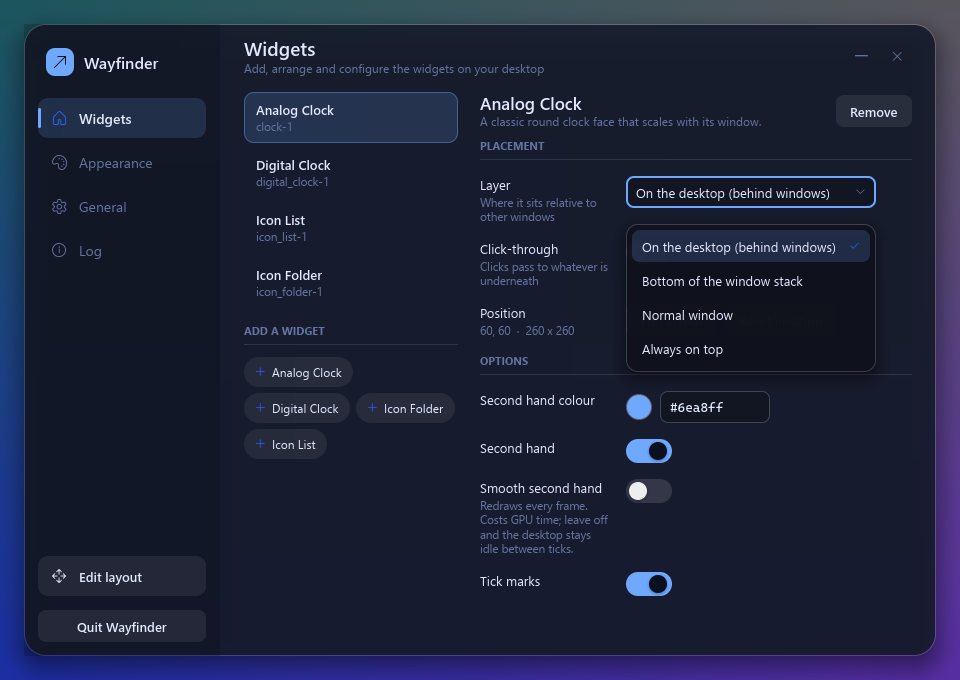
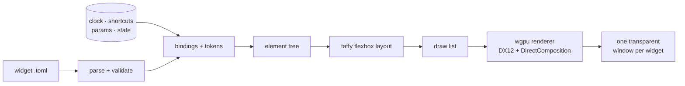

<div align="center">

# 🧭 Wayfinder

### Desktop widgets for Windows, rebuilt for the GPU era

Transparent, GPU-composited widgets that live on your desktop.
Move and resize them in real time, restyle everything, and pay nothing while they sit idle.

<br>

[](https://www.rust-lang.org)
[](#-quick-start)
[](https://wgpu.rs)
[](docs/adr/0001-dx12-dcomp-presentation.md)


<br>



<sub>The four built-in widgets, rendered by the engine itself. The last one is the icon folder, expanded in place.</sub>

<br>

[Quick start](#-quick-start) ·
[Using it](#-using-it) ·
[Make it yours](#-make-it-yours) ·
[How it works](#-how-it-works) ·
[Status](#-status)

</div>

<br>

## ✨ Why Wayfinder

Rainmeter and the Windows Vista/7 sidebar showed how good widgets on a desktop can be. Wayfinder keeps that idea and moves it onto a modern GPU stack.

|  |  |
|---|---|
| 🪟 **Real transparency** | One borderless window per widget with true per-pixel alpha (DirectComposition), soft shadows and rounded corners. No opaque backdrop, no colour-key tricks. |
| ✋ **Edit in place** | Drag a widget to move it, drag an edge or corner to resize it. Text and icons **reflow live** through a flexbox layout engine, with snapping to the grid, monitor edges and other widgets. Snaps glide instead of jumping, and elements slide to their new place when a widget reflows. |
| 📐 **Size-aware** | Widgets change what they show with their size, not just how big it is: a large clock adds other cities' times, a large system monitor adds every drive and a minute of history graphs, a narrow list drops to icons. |
| 😴 **Free when idle** | A widget redraws only when something it displays *can* have changed: the next minute, the next second, an animation frame, a click. A desktop of clocks sits at 0% CPU. |
| 📄 **Widgets are text files** | Describe a widget in TOML with bindings like `{clock.hour}` and design tokens like `$accent`. Save the file and it reloads instantly. Mistakes show a red error card in place. |
| 🎛️ **Settings for free** | Declare a typed option once (`color`, `number`, `bool`, `font`, `shortcuts`...) and Wayfinder builds the settings form for it: sliders, toggles, colour picker, dropdowns. |
| 🧩 **Plugins** | Share widgets, palettes, fonts and icons as one `.wfplugin` file. Double-click it to install, switch it off or remove it in Settings. For live data a plugin can carry Rust code, run sandboxed as WebAssembly: it reaches only the hosts it lists and never starts programs. |
| 🎨 **Themeable end to end** | Swap palette, font set, glyph set and icon pack independently, for all widgets or just one. Transparency, blur, shadow, outlines, roundness, text size and animation speed are global settings any widget can override. Drop in your own `.ttf` fonts, palettes and app icons. |
| 🛡️ **Hard to break** | The binding language cannot loop or hang. A broken widget file never crashes the desktop, and a GPU reset rebuilds the renderer instead of taking widgets down. |

<br>

## 🚀 Quick start

You need Windows 10 or 11 and a [Rust toolchain](https://rustup.rs) (edition 2024).

```powershell
git clone https://github.com/mzak-dev/desktopWidgets.git
cd desktopWidgets
cargo build --release
.\target\release\wayfinder.exe
```

The first run puts four widgets on the right-hand side of your main monitor, clear of your desktop icons, and adds a **tray icon**. Left-click the tray icon for Settings.

<details>
<summary><b>Try it without touching your GPU driver</b></summary>

<br>

Wayfinder can render on the CPU (the "Microsoft Basic Render Driver"). It is slower, but it never touches the vendor GPU driver, which makes it a good first run and the mode the automated tests use:

```powershell
.\target\release\wayfinder.exe --gpu software --data $env:TEMP\wayfinder-try
```

`--data` points it at a throwaway data folder so your real settings stay untouched.

</details>

<br>

## 🖱️ Using it

<table>
<tr>
<td width="50%" valign="top">

### Edit layout

Press **`Ctrl` + `Alt` + `E`** (or use the tray menu) to enter Edit Mode. Every widget gets an outline and eight handles.

| | |
|---|---|
| Drag the body | move |
| Drag an edge / corner | resize, with live reflow, within the widget's size limits |
| The × in the bottom-right corner | remove (click twice) |
| `Shift` while dragging | ignore snapping |
| Arrow keys | nudge 1 px (`Shift`: 10 px) |
| `Ctrl` + `Z` | undo |
| `Esc` | finish |

</td>
<td width="50%" valign="top">

### Settings



Add and remove widgets and edit them: the widget sits at the top with a tab per size, and its modules (a gauge, a graph, the footer) are dragged into place, hidden or given their own options. Layer (desktop, bottom, normal, always on top), click-through and the style overrides are under Advanced. The window resizes and maximizes like any other. The Plugins page installs, switches off and removes plugins.

</td>
</tr>
</table>

Your arrangement is saved to `workspace.json`. Unplug a monitor and its widgets are **parked**: hidden but remembered, and back exactly where they were when the monitor returns.

<br>

## 🧩 Built-in widgets

| Widget | What it does | Notable options |
|---|---|---|
| 🕰️ **Analog Clock** | Round face with tick marks and hands. **Wide**, it lists other cities beside the face; **tall or large**, it shows them as chips under it. | second hand on/off, **smooth** second hand, tick marks, cities |
| 🔢 **Digital Clock** | Large time with the date beneath, in your Windows language. **Tall**, it adds other cities' times. | 24 h / 12 h, seconds, date, cities |
| 📊 **System Monitor** | CPU, memory, drives and battery. **Small**: bars. **Medium**: ring gauges that shrink to fit. **Large**: every drive, memory commit and a minute of CPU, memory and download graphs. | which gauges, graphs, colours, warn level |
| 📋 **Icon List** | App shortcuts that scroll when they overflow. **Narrow**: icons only. **Wide**: a grid of tiles. | shortcuts, mirror a folder, icon size, labels |
| 📁 **Icon Folder** | A tile with a preview (2×2, or 3×3 when large) that **expands in place** into an icon grid, growing away from the screen edge. | shortcuts, mirror a folder, columns, icon size |
| 🗄️ **Drawer** | A collapsible drawer of app shortcuts with its own folder. **Narrow**: icons only. | title, icon size |

<br>

## 🎨 Make it yours

Everything lives in one data folder (`%APPDATA%\Wayfinder`) and reloads as you save.

```text
Wayfinder/
├─ workspace.json        your arrangement and settings (written by the app)
├─ widgets/              *.toml  your own widgets, or copies of built-ins to change
├─ palettes/             *.toml  colour sets
├─ fonts/                *.toml font sets, plus .ttf / .otf files to make selectable
├─ glyphs/               *.toml  icon sets for buttons and chrome
├─ iconpacks/<name>/     chrome.png ...  replaces the icon of a matching app
├─ plugins/<id>/         installed plugins, each laid out like this folder
├─ THEMES.md             how to make palettes, font sets, glyph sets and icon packs
├─ PLUGINS.md            how to make and share a plugin
└─ .claude/skills/       Claude Code skills for making themes and plugins
```

Wayfinder writes `THEMES.md`, `PLUGINS.md` and their Claude Code skills at startup when they are missing, and never overwrites your edits. Run `claude` in the data folder and ask for a theme ("a warm sunset palette") or a plugin to have Claude Code write the files for you.

### Plugins

A plugin bundles widgets, palettes, font sets, glyph sets and icon packs. It is a folder laid out like the data folder, with a `plugin.toml`:

```toml
id = "sunset"
name = "Sunset"
version = "1.2.0"
author = "Ada"
description = "Warm evening colours and a weather card."
```

To share one, zip its folder and rename the zip to `.wfplugin`. Double-click the file (the first Wayfinder build to start takes `.wfplugin` files; **Settings → General → Plugin files** hands them to another), drop it on the Settings window or use **Install from file...** in **Settings → Plugins**, where each plugin can be switched off or removed. A switched-off plugin's widgets are hidden and come back in place when it is switched on again. Plugins load after the built-ins and before your own files, so a plugin can restyle a built-in widget and your own copy still wins. A plugin's widgets can show its own images with `src = "./logo.png"`. Only content files unpack (`toml`, fonts, images, text, plus a `.wasm` module), and a widget can never launch anything inside `plugins/`. See `PLUGINS.md` in the data folder and [ADR-007](docs/adr/0007-content-plugins.md).

**Plugin code.** For live data (weather, feeds, a to-do list) a plugin can carry a **Code Source**: Rust compiled to WebAssembly with the [`wayfinder-plugin`](sdk/README.md) crate, run in the wasmi interpreter on its own thread. Its widgets bind to it like any other data (`{weather.temp}`, `on_click = "weather.refresh"`). It may reach only the HTTPS hosts its `plugin.toml` lists, read only the folders it lists (read-only, like `~/.claude`), keep 1 MB of saved data, and must answer within a time and memory budget. It cannot write files or start programs, has no WASI, and a widget showing its data opens only `https://` links and what its plugin lists. [`sdk/examples/weather`](sdk/examples/weather) is a complete plugin; see [ADR-008](docs/adr/0008-plugin-code.md).

<table>
<tr>
<td width="50%"></td>
<td width="50%"></td>
</tr>
<tr>
<td align="center"><sub>Palettes, fonts, glyphs, icon packs and an accent picker</sub></td>
<td align="center"><sub>Options are generated from the widget's declared parameters</sub></td>
</tr>
</table>

### Write a widget

```toml
name = "My Clock"
size = [240, 120]
min_size = [160, 80]            # Edit Mode resizes within these;
max_size = [480, 240]           # a widget's "Size limit" switch lifts the max

[params.accent]                 # becomes a colour picker in Settings
type = "color"
default = "$accent"
label = "Accent"

[root]
fill = ["$surface", "$surface-2"]    # $tokens come from the active theme
radius = "$radius-lg"
align = "center"
justify = "center"

  [[root.children]]
  type = "text"
  text = "{pad(clock.hour, 2)}:{pad(clock.minute, 2)}"     # live binding
  size = "{min(self.h * 0.5, self.w * 0.2)}"               # scales with the window
  color = "{param.accent}"
```

<details>
<summary><b>Reference: elements, attributes and expressions</b></summary>

<br>

**Elements:** `box` · `text` · `image` · `hand` · `ticks` · `arc` · `graph` (a line through `values`, `span` slots wide) · `repeat` (one child per list item) · `slot` (the box arranged Modules fill).

| Group | Attributes |
|---|---|
| Layout (flexbox) | `direction` `wrap` `align` `justify` `gap` `padding` `margin` `width` `height` `min_*` `max_*` `grow` `shrink` `basis` `aspect` `position` `inset` |
| Look | `fill` (or `[top, bottom]` gradient) `border` `border_color` `radius` `shadow` `opacity` `clip` |
| Text | `text` `size` `color` `font` `weight` `text_align` `text_wrap` `line_height` |
| Image | `src` (PNG, JPEG, WebP, GIF, BMP; `./` is next to the widget file, or a full path like `{item.target}`) `tint` `fit` (`contain` · `cover`) `max` (`max = 256`: a small copy, made off the UI thread and kept in `.cache/thumbs`; use it for photo grids) `anim` (`false` stops a GIF, WebP or APNG) `frame` (show one frame) |
| Behaviour | `on_click` (`launch <path>` · `toggle <state>` · `set <state> <value>`, where numbers and `true`/`false` keep their type and `'quotes'` keep text) `on_drop` (a dropped file's path follows the action; `on_drop = "param folder"` saves it as the widget's `folder` setting) · `param <name> <value>` in `on_click` saves a setting too `hover` `transition` `enter` `scroll` `scroll_x` (sideways; the wheel over it writes `state.scroll_x`, Shift+wheel too) `when` |

**Data you can bind to:** `clock.*` (hour, minute, second, date, angles for hands, and `clock.zones` for a `cities` param) · `sys.*` (gauges, `gauges_all`, `graphs`, `gpus` (one per adapter: `label` `value` `history`), `gpu_count`, `cpu_history`, `ram_history`, `net_history`, `net_down`, `net_up`, uptime) · `shortcuts.items` · `media.*` (what any app plays through the system media controls: `title` `artist` `album` `source` `playing` `art` `position` `duration` `progress` `clock` `length` `active`; `on_click = "media.play_pause"`, `media.next`, `media.prev`) · `audio.*` (what the speakers play, for visualizers: `bands` `peaks` `level` `bass` `active`, shaped by the widget's `bands` `fmin` `fmax` `gain` `attack` `release` `peak_fall` params) · `param.*` · `state.*` · `self.w` / `self.h`.

**Size tiers** are plain `when` conditions on `self.w` and `self.h`: show more when there is room. The engine animates the change.

**Modules** let the user arrange a widget in Settings: the widget on top, a tab per size, and the parts dragged between slots or into a Hidden tray. A file opts in by declaring what can move:

```toml
[tiers.compact]                       # first tier whose `when` holds; one without `when` is the fallback
size = [240, 130]                     # what Settings previews the tab at
when = "{self.w < 260}"
layout = { bars = ["gauge:cpu", "gauge:gpu*"] }   # the default: slot -> modules (`*` matches a prefix)
[tiers.normal]
layout = { gauges = ["gauge:cpu", "gauge:gpu*"] }
[slots.bars]
[slots.gauges]
[modules.gauge]                       # a Module is a box, or any element; `for` makes one per item
for = "{sys.gauges_all}"
as = "g"
key = "{g.key}"                       # ids are `gauge:<key>`
slots = ["bars", "gauges"]            # where it may be dropped
when = "{sys.has_battery}"            # optional: whether it exists at all
label = "{g.label}"
direction = "{slot == 'bars' ? 'row' : 'column'}"   # `tier` and `slot` are available inside
[root]
[[root.children]]
type = "slot"                         # the box the arranged modules fill
slot = "gauges"
when = "{tier != 'compact'}"
max = "{floor((self.w - 28) / 50)}"   # optional: how many fit; the rest are left out, not overflowed
```

A `[params.x]` with `module = "gauge:cpu,graph:cpu"` shows in Settings only while one of those modules is selected; without it, it is an option of the whole widget. `legacy = { "gauge:cpu" = "show_cpu" }` on a module turns an old saved `show_cpu = false` into a layout without it. Files without `[modules]` work as before.

**Expressions** are total: arithmetic, comparison, `&&` `||` `!`, `? :`, strings and the functions `min` `max` `abs` `round` `floor` `ceil` `clamp` `len` `upper` `lower` `pad` `at`. `at(list, i)` picks by a computed position (negative counts from the end, past the end is nothing) or key, and takes a field after it: `at(gallery.items, state.selected).url`. There are no loops and no side effects, so evaluating one can never hang a redraw. Interpolate with `{expr}` or format with `{expr|02}` / `{expr|.1}`.

Unknown attributes are rejected with a suggestion, for example ``unknown attribute `colour` on `text` (did you mean `color`?)``.

**Params** become Settings controls: `type` (`color` · `font` · `number` · `enum` · `bool` · `string` · `folder` (a folder picker; also `path`) · `duration` · `shortcuts`), `default`, `label`, `help`, `min` / `max` / `step`, and for an `enum` its `choices`, plain strings or `{ value = "fast", label = "Fast (30 fps)" }`. Params with the same `group = "Motion"` get their own heading.

**Needs:** `needs = ["agents"]` at the top of a widget names the data sources it cannot work without. When one is missing, the widget and Settings say which, instead of showing a blank card.

**Seeds:** `seed = "starter-apps"` on a `shortcuts` param gives each new Instance a few apps to start from. Unlike `default`, a seed is written once and then edited like any other value.

</details>

<br>

## ⚙️ How it works



The settings window is built from the same element tree in Rust, so widgets and settings share **one layout path and one renderer**. The renderer only ever sees a flat draw list, so it can be swapped without touching anything above it.

| | |
|---|---|
| `src/widgets/` | the Widget seam: TOML and Rust Widgets, the registry, the build pipeline |
| `src/content.rs` `plugins.rs` | the Catalog: content from the built-ins, each Plugin and the data folder, in that order; installing and removing Plugins |
| `src/code/` `net.rs` | Code Sources: the wasmi runtime, the worker and its schedule, plugin data, and the HTTPS policy (`platform/winhttp.rs` moves the bytes) |
| `sdk/` | the `wayfinder-plugin` crate for writing plugin code, and a weather example |
| `src/format.rs` `expr.rs` | TOML widget format and the total expression language |
| `src/elements/` | one file per element kind: its attributes, build and drawing |
| `src/data/` | one file per Data Source (`clock`, `sys`, `shortcuts`) and how often it changes |
| `src/card.rs` | the card inside each window: shadow gutter, blur, outlines |
| `src/ui.rs` `text.rs` `anim.rs` | element tree, taffy layout, text shaping (glyphon), declarative transitions |
| `src/gfx.rs` `draw.rs` `shader.wgsl` | wgpu renderer, SDF shapes, premultiplied alpha |
| `src/app/` `edit.rs` `workspace.rs` | windows, scheduling, input, Edit Mode, Show Desktop, persistence and monitor anchoring |
| `src/settings.rs` | the animated settings window |
| `src/platform/win32.rs` | window styles, z-order, Show Desktop, monitors |

### Decisions worth knowing

Each one is written up with its measurements in [`docs/adr/`](docs/adr).

| | |
|---|---|
| [DirectX 12 + DirectComposition](docs/adr/0001-dx12-dcomp-presentation.md) | The only path on Windows that gives real per-pixel window alpha. A plain swapchain reports `Opaque` only, and Vulkan's support varies by driver. |
| [Z-order like Rainmeter](docs/adr/0002-z-order-by-reassertion.md) | Widgets sit just above the desktop layer. A hidden sentinel window tells Show Desktop from normal, and Desktop-layer widgets float over the raised desktop. Nothing is reparented into the shell. |
| [No Wallpaper Engine integration](docs/adr/0003-no-wallpaper-engine-integration.md) | It exposes no API, so there is nothing to integrate with. |
| [Declarative animation](docs/adr/0004-declarative-animation.md) | The engine owns the clock, so it always knows whether anything is animating, which is what makes "free when idle" possible. |
| [Adapter and present mode](docs/adr/0005-adapter-and-present-mode.md) | `Mailbox` presentation, and the integrated GPU by default (see below). |
| [Swapchain sizing and GPU loss](docs/adr/0006-swapchain-resize-and-gpu-loss.md) | Resizing a composition swapchain every frame is fragile, so it is sized in buckets, and a lost device is rebuilt. |
| [Content plugins](docs/adr/0007-content-plugins.md) | A `.wfplugin` is a zip that installs by unpacking. Widget ids stay flat, so a plugin can restyle built-ins. No native code. |
| [Plugin code](docs/adr/0008-plugin-code.md) | WebAssembly Code Sources in wasmi, one thread per plugin, a JSON ABI, HTTPS to listed hosts, read-only folders it declares and 1 MB of saved data. The UI never waits for plugin code. |
| [Native sources in your own build](docs/adr/0009-native-sources-in-your-own-build.md) | Native code joins through an exe built on the engine as a library, never through DLLs. Sources can act, notify and forget Instances like Code Sources. |

> [!IMPORTANT]
> **Which GPU?** Wayfinder defaults to the **integrated** GPU (`"gpu": "low"`). On the AMD machine it was developed on, selecting the dedicated GPU pinned one CPU core at 99% while idle with two or more widgets on screen, in a driver thread outside Wayfinder, whereas the integrated GPU idled at 0.00%. Widgets are tiny, so the integrated GPU is plenty. You can change it in **Settings → General**, or set `"gpu": "high"` in `workspace.json`. `"software"` renders on the CPU. Details in [ADR-005](docs/adr/0005-adapter-and-present-mode.md).

<br>

## 📊 Status

**Alpha.** It works and is tested, but it is young.

<table>
<tr>
<td width="50%" valign="top">

**✅ Verified**

- 264 unit tests (`cargo test --lib`)
- All four widgets and the settings window rendered offscreen
- A 35-check scripted run of the live app, on the **software** renderer: drag, live resize, undo, saving, folder expand and z-raise, hot reload with error cards, the settings commands, and Show Desktop detection and response (against a stand-in host window)

</td>
<td width="50%" valign="top">

**⚠️ Not verified yet**

- The windowed app on a real GPU after the swapchain fix ([ADR-006](docs/adr/0006-swapchain-resize-and-gpu-loss.md))
- Show Desktop against the real Explorer (`Win` + `D`): the mechanism is Rainmeter's ([ADR-002](docs/adr/0002-z-order-by-reassertion.md)) and is tested with a stand-in host, but a real run is still to do
- Fullscreen games, multiple monitors, mixed DPI, monitor hot-unplug
- Vulkan and OpenGL (`WAYFINDER_BACKEND`) are for experiments only: on the development machine Vulkan reports no transparency

</td>
</tr>
</table>

**Ideas, not promises:** a plugin catalogue to browse and install from, shader widgets, an installer.

<br>

## 🛠️ Development

```powershell
cargo test --lib                     # 264 unit tests, pure logic, no GPU
cargo run --release -- --selftest --gpu software --data $env:TEMP\wf-test
```

Offscreen renders, on the software adapter by default:

```powershell
cargo run --release --example render_widgets  -- docs\img\widgets.png
cargo run --release --example render_settings -- docs\img
```

### Extend it

Each kind of extension is one file plus one line of registration:

| To add | Write | Register |
|---|---|---|
| a built-in TOML widget | `assets/widgets/<id>.toml` | nothing: `build.rs` finds it |
| a Rust widget | `src/widgets/<id>.rs` implementing `Widget` (the Drawer is the example) | `registry.rs` |
| a data source | `src/data/<name>.rs` implementing `DataSource`, with the cadence of each field | `DataSources::builtin` |
| a data source in your own build | a `DataSource` in a crate that depends on `wayfinder` | `Options.extra_sources` before `wayfinder::run` |
| an element kind | `src/elements/<name>.rs` with a `KIND` and, if it draws, a `Shape` | `elements::KINDS` |
| a Workspace-wide style switch | a `Flag` variant and its `Workspace` field | a `flag_row` in Settings |
| widgets and themes to share | a folder with `plugin.toml` in `<data>/plugins/` (see `assets/guides/PLUGINS.md`) | nothing: it loads as you save |
| live data from a plugin | a Rust crate on [`wayfinder-plugin`](sdk/README.md), built for `wasm32-unknown-unknown` | a `[code]` table in its `plugin.toml` |

**Your own build.** The engine is a library: an app can add native data sources (media keys, audio levels) and ship its own exe. A source says it changed through the `Notifier` it is given in `attach`, handles `on_click = "media.play_pause"` in `act`, saves a widget's setting with `Notifier::set_param` (a folder dropped on a gallery survives a restart), frees per-widget state in `retain`, and gives a `cadence(field, cx)` that may follow its state (`Second` while playing, `None` while paused):

```rust
fn main() {
    let mut o = wayfinder::Options::from_args();
    o.extra_sources.push(Box::new(media::Media::default()));
    wayfinder::run(o);
}
```

**Command line for authors.** These print to the console and exit. Wayfinder is a Windows app, so pipe its output (`| Out-Host`) for the shell to wait for it and set `$LASTEXITCODE`:

```powershell
wayfinder --render-widget sunset_weather --png out.png --size 300x200 --param city=Oslo --time 15:42   # also a path to a .toml
wayfinder plugin pack plugins\sunset            # sunset.wfplugin next to the folder, checked
wayfinder plugin check sunset.wfplugin          # 0 when it installs and loads cleanly, 1 with problems
```

`--render-widget` renders through the real pipeline on the software adapter, with plugin code running (`--wait` seconds for its first answer), so CI can check widgets without a desktop. `wayfinder::plugins::{describe, check, pack}` do the same from Rust; `describe` is a stable API.

> [!WARNING]
> `examples/phase0_spike.rs` is kept only as the record of the early measurements. **Do not run it**: it stress-tests multi-window swapchains and, together with the bug fixed in ADR-006, crashed an AMD driver during development.

<br>

## 🙏 Credits

Inspired by [Rainmeter](https://www.rainmeter.net) and the Windows Vista and 7 sidebar gadgets. Built on
[wgpu](https://wgpu.rs), [winit](https://github.com/rust-windowing/winit), [taffy](https://github.com/DioxusLabs/taffy),
[glyphon](https://github.com/grovesNL/glyphon), [`windows`](https://github.com/microsoft/windows-rs),
[tray-icon](https://github.com/tauri-apps/tray-icon), [notify](https://github.com/notify-rs/notify) and
[global-hotkey](https://github.com/tauri-apps/global-hotkey).

<div align="center">
<br>
<sub>No license has been chosen yet. Until one is added, all rights are reserved.</sub>
</div>

## Commit messages

Conventional Commits, Angular style: `type(scope): short summary`, imperative, lower case, no trailing period, under ~50 characters. Types: `feat`, `fix`, `docs`, `style`, `refactor`, `perf`, `test`, `build`, `ci`, `chore`. Keep the body to a line or two, only when the why isn't obvious.

Example: `feat(drawer): add blur and tint options`
