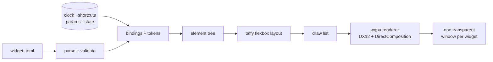

<div align="center">

# 🧭 Wayfinder

### Desktop widgets for Windows, rebuilt for the GPU era

Transparent, GPU-composited widgets that live on your desktop.
Move and resize them in real time, restyle everything, and pay nothing while they sit idle.

<br>

[](https://www.rust-lang.org)
[](#-quick-start)
[](https://wgpu.rs)
[](docs/adr/0001-dx12-dcomp-presentation.md)


<br>


<sub>The four built-in widgets, rendered by the engine itself. The last one is the icon folder, expanded in place.</sub>

<br>

[Quick start](#-quick-start) ·
[Using it](#-using-it) ·
[Make it yours](#-make-it-yours) ·
[How it works](#-how-it-works) ·
[Status](#-status)

</div>

<br>

## ✨ Why Wayfinder

Rainmeter and the Windows Vista/7 sidebar showed how good widgets on a desktop can be. Wayfinder keeps that idea and moves it onto a modern GPU stack.

|  |  |
|---|---|
| 🪟 **Real transparency** | One borderless window per widget with true per-pixel alpha (DirectComposition), soft shadows and rounded corners. No opaque backdrop, no colour-key tricks. |
| ✋ **Edit in place** | Drag a widget to move it, drag an edge or corner to resize it. Text and icons **reflow live** through a flexbox layout engine, with snapping to the grid, monitor edges and other widgets. |
| 😴 **Free when idle** | A widget redraws only when something it displays *can* have changed: the next minute, the next second, an animation frame, a click. A desktop of clocks sits at 0% CPU. |
| 📄 **Widgets are text files** | Describe a widget in TOML with bindings like `{clock.hour}` and design tokens like `$accent`. Save the file and it reloads instantly. Mistakes show a red error card in place. |
| 🎛️ **Settings for free** | Declare a typed option once (`color`, `number`, `bool`, `font`, `shortcuts`...) and Wayfinder builds the settings form for it: sliders, toggles, colour picker, dropdowns. |
| 🎨 **Themeable end to end** | Swap palette, font set, glyph set and icon pack independently. Drop in your own `.ttf` fonts, palettes and app icons. |
| 🛡️ **Hard to break** | The binding language cannot loop or hang. A broken widget file never crashes the desktop, and a GPU reset rebuilds the renderer instead of taking widgets down. |

<br>

## 🚀 Quick start

You need Windows 10 or 11 and a [Rust toolchain](https://rustup.rs) (edition 2024).

```powershell
git clone https://github.com/mzak-dev/desktopWidgets.git
cd desktopWidgets
cargo build --release
.\target\release\wayfinder.exe
```

The first run puts four widgets on the right-hand side of your main monitor, clear of your desktop icons, and adds a **tray icon**. Left-click the tray icon for Settings.

<details>
<summary><b>Try it without touching your GPU driver</b></summary>

<br>

Wayfinder can render on the CPU (the "Microsoft Basic Render Driver"). It is slower, but it never touches the vendor GPU driver, which makes it a good first run and the mode the automated tests use:

```powershell
.\target\release\wayfinder.exe --gpu software --data $env:TEMP\wayfinder-try
```

`--data` points it at a throwaway data folder so your real settings stay untouched.

</details>

<br>

## 🖱️ Using it

<table>
<tr>
<td width="50%" valign="top">

### Edit layout

Press **`Ctrl` + `Alt` + `E`** (or use the tray menu) to enter Edit Mode. Every widget gets an outline and eight handles.

| | |
|---|---|
| Drag the body | move |
| Drag an edge / corner | resize, with live reflow |
| `Shift` while dragging | ignore snapping |
| Arrow keys | nudge 1 px (`Shift`: 10 px) |
| `Ctrl` + `Z` | undo |
| `Esc` | finish |

</td>
<td width="50%" valign="top">

### Settings


Add and remove widgets, choose which layer each sits on (desktop, bottom, normal, always on top), make one click-through, and edit its options.

</td>
</tr>
</table>

Your arrangement is saved to `workspace.json`. Unplug a monitor and its widgets are **parked**: hidden but remembered, and back exactly where they were when the monitor returns.

<br>

## 🧩 Built-in widgets

| Widget | What it does | Notable options |
|---|---|---|
| 🕰️ **Analog Clock** | Round face with tick marks and hands. Scales cleanly to any size. | second hand on/off, **smooth** second hand, tick marks, accent colour |
| 🔢 **Digital Clock** | Large time with the date beneath, in your Windows language. Text scales with the window. | 24 h / 12 h, seconds, date, AM/PM colour |
| 📋 **Icon List** | A vertical list of app shortcuts that scrolls when it overflows. | shortcuts, mirror a folder, icon size, labels |
| 📁 **Icon Folder** | A tile with a 2×2 preview that **expands in place** into an icon grid, growing away from the screen edge. | shortcuts, mirror a folder, columns, icon size |

<br>

## 🎨 Make it yours

Everything lives in one data folder (`%APPDATA%\Wayfinder`) and reloads as you save.

```text
Wayfinder/
├─ workspace.json        your arrangement and settings (written by the app)
├─ widgets/              *.toml  your own widgets, or copies of built-ins to change
├─ palettes/             *.toml  colour sets
├─ fonts/                *.toml font sets, plus .ttf / .otf files to make selectable
├─ glyphs/               *.toml  icon sets for buttons and chrome
└─ iconpacks/<name>/     chrome.png ...  replaces the icon of a matching app
```

<table>
<tr>
<td width="50%"></td>
<td width="50%"></td>
</tr>
<tr>
<td align="center"><sub>Palettes, fonts, glyphs, icon packs and an accent picker</sub></td>
<td align="center"><sub>Options are generated from the widget's declared parameters</sub></td>
</tr>
</table>

### Write a widget

```toml
name = "My Clock"
size = [240, 120]

[params.accent]                 # becomes a colour picker in Settings
type = "color"
default = "$accent"
label = "Accent"

[root]
fill = ["$surface", "$surface-2"]    # $tokens come from the active theme
radius = "$radius-lg"
align = "center"
justify = "center"

  [[root.children]]
  type = "text"
  text = "{pad(clock.hour, 2)}:{pad(clock.minute, 2)}"     # live binding
  size = "{min(self.h * 0.5, self.w * 0.2)}"               # scales with the window
  color = "{param.accent}"
```

<details>
<summary><b>Reference: elements, attributes and expressions</b></summary>

<br>

**Elements:** `box` · `text` · `image` · `hand` · `ticks` · `repeat` (one child per list item).

| Group | Attributes |
|---|---|
| Layout (flexbox) | `direction` `wrap` `align` `justify` `gap` `padding` `margin` `width` `height` `min_*` `max_*` `grow` `shrink` `basis` `aspect` `position` `inset` |
| Look | `fill` (or `[top, bottom]` gradient) `border` `border_color` `radius` `shadow` `opacity` `clip` |
| Text | `text` `size` `color` `font` `weight` `text_align` `text_wrap` `line_height` |
| Behaviour | `on_click` (`launch <path>` · `toggle <state>`) `hover` `transition` `enter` `scroll` `when` |

**Data you can bind to:** `clock.*` (hour, minute, second, date, angles for hands) · `shortcuts.items` · `param.*` · `state.*` · `self.w` / `self.h`.

**Expressions** are total: arithmetic, comparison, `&&` `||` `!`, `? :`, strings and the functions `min` `max` `abs` `round` `floor` `ceil` `clamp` `len` `upper` `lower` `pad`. There are no loops and no side effects, so evaluating one can never hang a redraw. Interpolate with `{expr}` or format with `{expr|02}` / `{expr|.1}`.

Unknown attributes are rejected with a suggestion, for example ``unknown attribute `colour` on `text` (did you mean `color`?)``.

**Seeds:** `seed = "starter-apps"` on a `shortcuts` param gives each new Instance a few apps to start from. Unlike `default`, a seed is written once and then edited like any other value.

</details>

<br>

## ⚙️ How it works



The settings window is built from the same element tree in Rust, so widgets and settings share **one layout path and one renderer**. The renderer only ever sees a flat draw list, so it can be swapped without touching anything above it.

| | |
|---|---|
| `src/widgets/` | the Widget seam: TOML and Rust Widgets, the registry, the build pipeline |
| `src/format.rs` `expr.rs` | TOML widget format and the total expression language |
| `src/elements/` | one file per element kind: its attributes, build and drawing |
| `src/data/` | one file per Data Source (`clock`, `sys`, `shortcuts`) and how often it changes |
| `src/card.rs` | the card inside each window: shadow gutter, blur, outlines |
| `src/ui.rs` `text.rs` `anim.rs` | element tree, taffy layout, text shaping (glyphon), declarative transitions |
| `src/gfx.rs` `draw.rs` `shader.wgsl` | wgpu renderer, SDF shapes, premultiplied alpha |
| `src/app/` `edit.rs` `workspace.rs` | windows, scheduling, input, Edit Mode, Show Desktop, persistence and monitor anchoring |
| `src/settings.rs` | the animated settings window |
| `src/platform/win32.rs` | window styles, z-order, Show Desktop, monitors |

### Decisions worth knowing

Each one is written up with its measurements in [`docs/adr/`](docs/adr).

| | |
|---|---|
| [DirectX 12 + DirectComposition](docs/adr/0001-dx12-dcomp-presentation.md) | The only path on Windows that gives real per-pixel window alpha. A plain swapchain reports `Opaque` only, and Vulkan's support varies by driver. |
| [Z-order like Rainmeter](docs/adr/0002-z-order-by-reassertion.md) | Widgets sit just above the desktop layer. A hidden sentinel window tells Show Desktop from normal, and Desktop-layer widgets float over the raised desktop. Nothing is reparented into the shell. |
| [No Wallpaper Engine integration](docs/adr/0003-no-wallpaper-engine-integration.md) | It exposes no API, so there is nothing to integrate with. |
| [Declarative animation](docs/adr/0004-declarative-animation.md) | The engine owns the clock, so it always knows whether anything is animating, which is what makes "free when idle" possible. |
| [Adapter and present mode](docs/adr/0005-adapter-and-present-mode.md) | `Mailbox` presentation, and the integrated GPU by default (see below). |
| [Swapchain sizing and GPU loss](docs/adr/0006-swapchain-resize-and-gpu-loss.md) | Resizing a composition swapchain every frame is fragile, so it is sized in buckets, and a lost device is rebuilt. |

> [!IMPORTANT]
> **Which GPU?** Wayfinder defaults to the **integrated** GPU (`"gpu": "low"`). On the AMD machine it was developed on, selecting the dedicated GPU pinned one CPU core at 99% while idle with two or more widgets on screen, in a driver thread outside Wayfinder, whereas the integrated GPU idled at 0.00%. Widgets are tiny, so the integrated GPU is plenty. You can change it in **Settings → General**, or set `"gpu": "high"` in `workspace.json`. `"software"` renders on the CPU. Details in [ADR-005](docs/adr/0005-adapter-and-present-mode.md).

<br>

## 📊 Status

**Alpha.** It works and is tested, but it is young.

<table>
<tr>
<td width="50%" valign="top">

**✅ Verified**

- 45 unit tests (`cargo test --lib`)
- All four widgets and the settings window rendered offscreen
- A 35-check scripted run of the live app, on the **software** renderer: drag, live resize, undo, saving, folder expand and z-raise, hot reload with error cards, the settings commands, and Show Desktop detection and response (against a stand-in host window)

</td>
<td width="50%" valign="top">

**⚠️ Not verified yet**

- The windowed app on a real GPU after the swapchain fix ([ADR-006](docs/adr/0006-swapchain-resize-and-gpu-loss.md))
- Show Desktop against the real Explorer (`Win` + `D`): the mechanism is Rainmeter's ([ADR-002](docs/adr/0002-z-order-by-reassertion.md)) and is tested with a stand-in host, but a real run is still to do
- Fullscreen games, multiple monitors, mixed DPI, monitor hot-unplug
- Vulkan and OpenGL (`WAYFINDER_BACKEND`) are for experiments only: on the development machine Vulkan reports no transparency

</td>
</tr>
</table>

**Ideas, not promises:** scripted widgets in Lua (the Widget seam is in place: a Widget supplies an element tree and never draws), shader widgets, more data sources (network, media), an installer.

<br>

## 🛠️ Development

```powershell
cargo test --lib                     # 45 unit tests, pure logic, no GPU
cargo run --release -- --selftest --gpu software --data $env:TEMP\wf-test
```

Offscreen renders, on the software adapter by default:

```powershell
cargo run --release --example render_widgets  -- docs\img\widgets.png
cargo run --release --example render_settings -- docs\img
```

### Extend it

Each kind of extension is one file plus one line of registration:

| To add | Write | Register |
|---|---|---|
| a built-in TOML widget | `assets/widgets/<id>.toml` | nothing: `build.rs` finds it |
| a Rust widget | `src/widgets/<id>.rs` implementing `Widget` (the Drawer is the example) | `registry.rs` |
| a data source | `src/data/<name>.rs` implementing `DataSource`, with the cadence of each field | `DataSources::builtin` |
| an element kind | `src/elements/<name>.rs` with a `KIND` and, if it draws, a `Shape` | `elements::KINDS` |
| a Workspace-wide style switch | a `Flag` variant and its `Workspace` field | a `flag_row` in Settings |

> [!WARNING]
> `examples/phase0_spike.rs` is kept only as the record of the early measurements. **Do not run it**: it stress-tests multi-window swapchains and, together with the bug fixed in ADR-006, crashed an AMD driver during development.

<br>

## 🙏 Credits

Inspired by [Rainmeter](https://www.rainmeter.net) and the Windows Vista and 7 sidebar gadgets. Built on
[wgpu](https://wgpu.rs), [winit](https://github.com/rust-windowing/winit), [taffy](https://github.com/DioxusLabs/taffy),
[glyphon](https://github.com/grovesNL/glyphon), [`windows`](https://github.com/microsoft/windows-rs),
[tray-icon](https://github.com/tauri-apps/tray-icon), [notify](https://github.com/notify-rs/notify) and
[global-hotkey](https://github.com/tauri-apps/global-hotkey).

<div align="center">
<br>
<sub>No license has been chosen yet. Until one is added, all rights are reserved.</sub>
</div>

## Commit messages

Conventional Commits, Angular style: `type(scope): short summary`, imperative, lower case, no trailing period, under ~50 characters. Types: `feat`, `fix`, `docs`, `style`, `refactor`, `perf`, `test`, `build`, `ci`, `chore`. Keep the body to a line or two, only when the why isn't obvious.

Example: `feat(drawer): add blur and tint options`
