<div align="center">

# 🧭 Wayfinder

### Desktop widgets for Windows, rebuilt for the GPU era

Transparent, GPU-composited widgets that live on your desktop.
Move and resize them in real time, restyle everything, and pay nothing while they sit idle.

<br>

[](https://www.rust-lang.org)
[](#-quick-start)
[](https://wgpu.rs)
[](docs/adr/0001-dx12-dcomp-presentation.md)


<br>

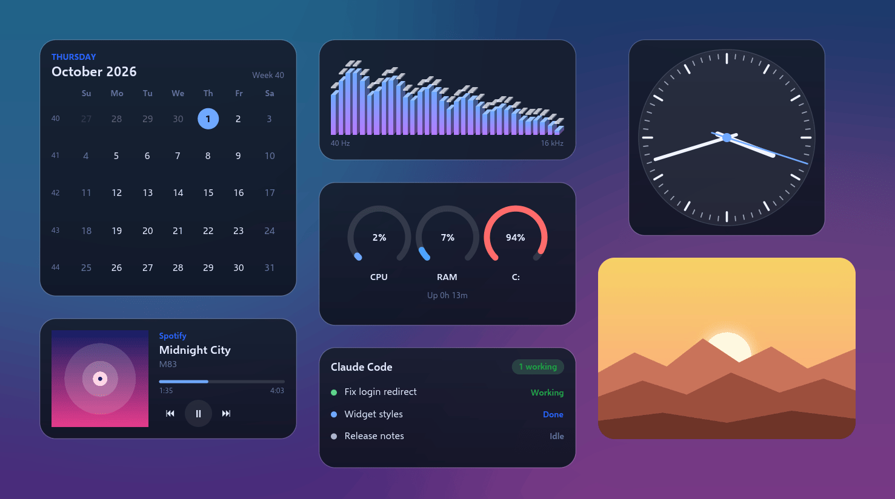

<sub>Seven of the thirteen built-in widgets, drawn by the engine itself with sample data.</sub>

<br>

[Quick start](#-quick-start) ·
[The widgets](#-the-widgets) ·
[Four sizes](#-one-widget-four-sizes) ·
[Visualizer](#%EF%B8%8F-the-audio-visualizer) ·
[Make it yours](#-make-it-yours) ·
[Workspaces](#%EF%B8%8F-workspaces) ·
[Write a widget](#%EF%B8%8F-write-a-widget) ·
[How it works](#%EF%B8%8F-how-it-works)

</div>

<br>

## ✨ Why Wayfinder

Rainmeter and the Windows Vista/7 sidebar showed how good widgets on a desktop can be. Wayfinder keeps that idea and moves it onto a modern GPU stack.

|  |  |
|---|---|
| 🪟 **Real transparency** | One borderless window per widget with true per-pixel alpha (DirectComposition), soft shadows and rounded corners. No opaque backdrop, no colour-key tricks. |
| ✋ **Edit in place** | Drag a widget to move it, drag an edge or corner to resize it. Text and icons **reflow live** through a flexbox layout engine, with snapping to the grid, monitor edges and other widgets. |
| 📐 **Size-aware** | Widgets change *what* they show with their size, not just how big it is: one line when low, the essentials when small, details beside them when wide, everything when large. |
| 😴 **Free when idle** | A widget redraws only when something it displays *can* have changed: the next minute, the next second, an animation frame, a click. A desktop of clocks sits at 0% CPU. |
| 📄 **Widgets are text files** | Describe a widget in TOML with bindings like `{clock.hour}` and design tokens like `$accent`. Save the file and it reloads instantly. Mistakes show a red error card in place. |
| 🎛️ **Settings for free** | Declare a typed option once (`color`, `number`, `bool`, `enum`, `font`, `folder`, `shortcuts`...) and Wayfinder builds the settings form for it. |
| 🗂️ **Workspaces** | Several sets of widgets, each with its own positions, options and look, that come up by themselves on a virtual desktop or when you dock. |
| 🧩 **Plugins** | Share widgets, palettes, fonts and icons as one `.wfplugin` file. For live data a plugin can carry Rust code, run sandboxed as WebAssembly. |
| 🛡️ **Hard to break** | The binding language cannot loop or hang. A broken widget file never crashes the desktop, and a GPU reset rebuilds the renderer instead of taking widgets down. |

<br>

## 🚀 Quick start

You need Windows 10 or 11 and a [Rust toolchain](https://rustup.rs) (edition 2024).

```powershell
git clone https://github.com/mzak-dev/desktopWidgets.git
cd desktopWidgets
cargo build --release
.\target\release\wayfinder.exe
```

The first run puts four widgets on the right-hand side of your main monitor, clear of your desktop icons, and adds a **tray icon**. Left-click the tray icon for Settings; press **`Ctrl` + `Shift` + `E`** to move and resize widgets.

<details>
<summary><b>Try it without touching your GPU driver</b></summary>

<br>

Wayfinder can render on the CPU (the "Microsoft Basic Render Driver"). It is slower, but it never touches the vendor GPU driver, which makes it a good first run and the mode the automated tests use:

```powershell
.\target\release\wayfinder.exe --gpu software --data $env:TEMP\wayfinder-try
```

`--data` points it at a throwaway data folder so your real settings stay untouched.

</details>

<br>

## 🖱️ Using it

<table>
<tr>
<td width="44%" valign="top">

### Edit layout

Press **`Ctrl` + `Shift` + `E`** (or use the tray menu) to enter Edit Mode. Every widget gets an outline and eight handles.

| | |
|---|---|
| Drag the body | move |
| Drag an edge / corner | resize, with live reflow |
| The × in the corner | remove (click twice) |
| `Shift` while dragging | ignore snapping |
| Arrow keys | nudge 1 px (`Shift`: 10 px) |
| `Ctrl` + `Z` | undo |
| `Esc` | finish |

Your arrangement is saved to `workspace.json`. Unplug a monitor and its widgets are **parked**: hidden but remembered, and back where they were when it returns.

</td>
<td width="56%" valign="top">

### Settings

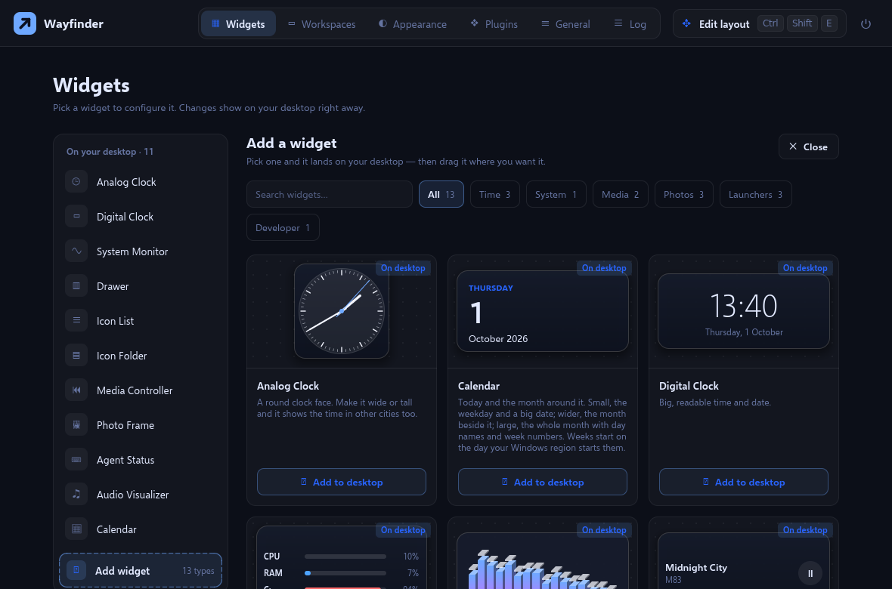

**Widgets** adds, removes and edits widgets: each one sits at the top with a tab per size, and its parts are dragged into place or hidden. **Workspaces**, **Appearance**, **Plugins**, **General** and a **Log** have their own pages.

</td>
</tr>
</table>

<br>

## 🧩 The widgets

| | Widget | What it shows | Options you can change |
|---|---|---|---|
| 🕰️ | **Analog Clock** | A round face with ticks and hands. Wide, other cities beside it; tall, as chips under it. | second hand, **smooth** sweep, ticks, cities |
| 🔢 | **Digital Clock** | The time with the date beneath, in your Windows language. Tall, other cities. | 24 h / 12 h, seconds, date, cities |
| 📅 | **Calendar** | Today and its month; weeks start on your region's first day. Large: day names and ISO week numbers. | week numbers, the months around, today's colour |
| 📊 | **System Monitor** | CPU, memory, GPUs, drives and battery: bars, then ring gauges, then a minute of history graphs. | which gauges and graphs, where, colours, warn level |
| 🎵 | **Media Controller** | Whatever plays through the Windows media controls, with a seek bar you drag. | source app, progress, cover, card |
| 🎚️ | **Audio Visualizer** | What the speakers play, live, in [eight styles](#%EF%B8%8F-the-audio-visualizer). | style, bands, frequencies, motion, 3D depth, sweep, colours |
| 🖼️ | **Photo Frame** | One photo at a time from a folder, crossfading every few seconds to an hour. | folder (or drop one), interval, shuffle, fit |
| 🗂️ | **Photo Gallery** | A grid of a folder's photos; an open photo gets a filmstrip, its date and size. | folder, thumbnail size, order, names |
| 🎞️ | **GIF Player** | An animated GIF, WebP or APNG, with a strip to choose from when large. Click to pause. | file or folder, fit, card |
| 🤖 | **Agent Status** | Claude Code, Copilot CLI and Antigravity CLI sessions: how many work, what each does, which just finished. | tool or all, folders, colours |
| 📋 | **Icon List** | App shortcuts that scroll; icons only when narrow, tiles when wide. | shortcuts, mirror a folder, icon size, labels |
| 📁 | **Icon Folder** | A tile with a preview that **expands in place** into an icon grid. | shortcuts, mirror a folder, columns, icon size |
| 🗄️ | **Drawer** | A collapsible drawer of app shortcuts with its own folder. | title, icon size |

<table>
<tr>
<td width="50%">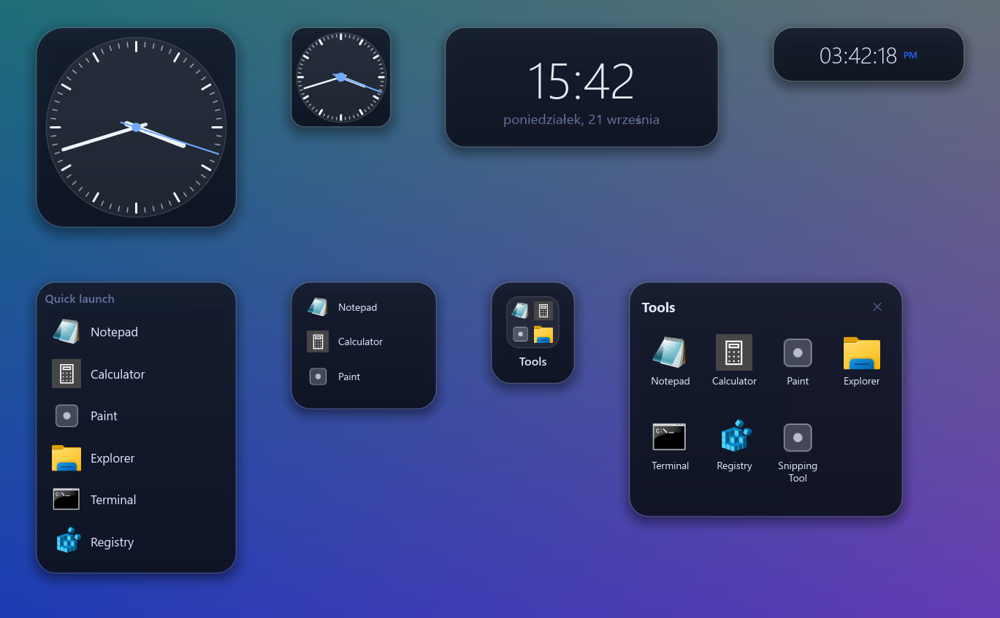</td>
<td width="50%">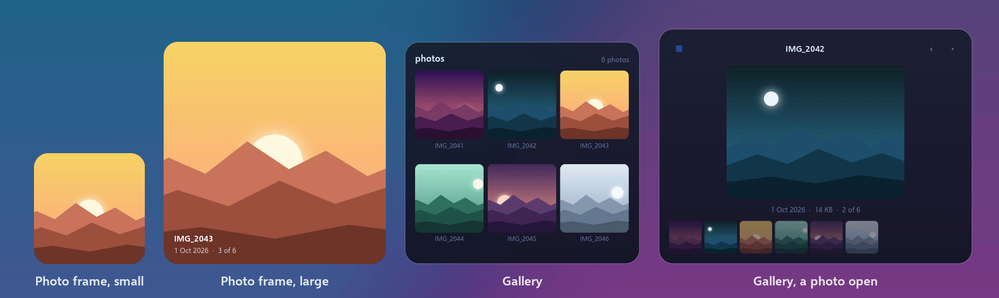</td>
</tr>
<tr>
<td align="center"><sub>Clocks and launchers, rendered on Windows</sub></td>
<td align="center"><sub>Photo Frame and Photo Gallery at different sizes</sub></td>
</tr>
</table>

<br>

## 📐 One widget, four sizes

Drag a corner and a widget doesn't just scale: it decides what fits. The newer widgets share the same four size families, like widgets on macOS, so a layout of them stays consistent.

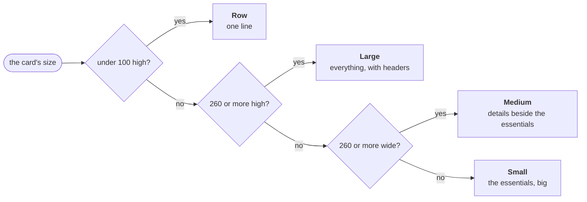
```mermaid
flowchart LR
    S(["the card's size"]) --> R{"under 100 high?"}
    R -- yes --> ROW["<b>Row</b><br/>one line"]
    R -- no --> T{"260 or more high?"}
    T -- yes --> L["<b>Large</b><br/>everything, with headers"]
    T -- no --> W{"260 or more wide?"}
    W -- yes --> M["<b>Medium</b><br/>details beside the essentials"]
    W -- no --> SM["<b>Small</b><br/>the essentials, big"]
```

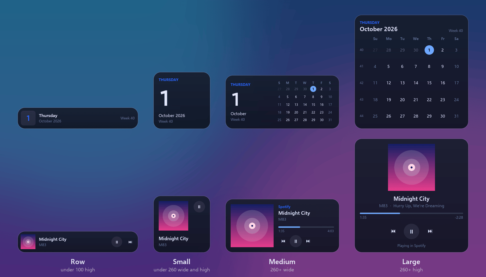

A widget file says this with plain conditions on its own size (`when = "{self.h >= 260}"`), so your own widgets can do the same. A narrow visualizer draws every second band, a short one drops its frequency scale, and the engine animates each change.

<br>

## 🎚️ The audio visualizer

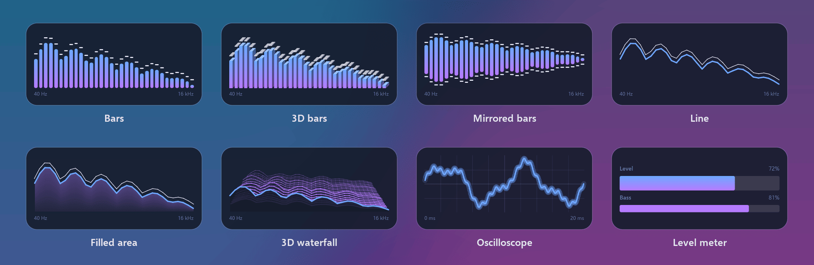

It listens to what your speakers play (WASAPI loopback, nothing leaves your PC) only while a visualizer is on screen, and stops a few seconds after. While nothing plays it fades to the opacity you choose and costs nothing.

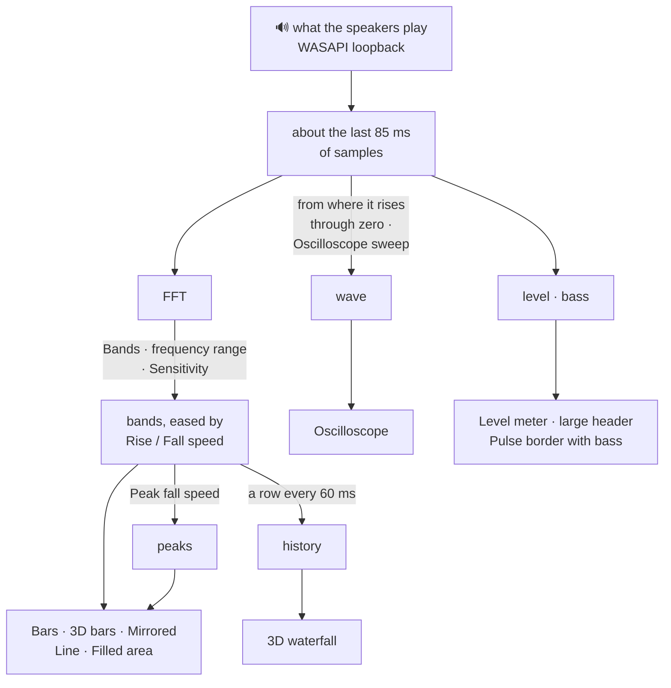
```mermaid
flowchart TB
    SP["🔊 what the speakers play<br/>WASAPI loopback"] --> RG["about the last 85 ms<br/>of samples"]
    RG --> FFT["FFT"]
    RG -- "from where it rises<br/>through zero ·<br/>Oscilloscope sweep" --> WV["wave"]
    RG --> LV["level · bass"]
    FFT -- "Bands · frequency range<br/>· Sensitivity" --> SM["bands, eased by<br/>Rise / Fall speed"]
    SM -- "Peak fall speed" --> PK["peaks"]
    SM -- "a row every 60 ms" --> H["history"]
    SM --> ST1["Bars · 3D bars · Mirrored<br/>Line · Filled area"]
    PK --> ST1
    H --> ST2["3D waterfall"]
    WV --> ST3["Oscilloscope"]
    LV --> ST4["Level meter · large header<br/>Pulse border with bass"]
```

| Style | What you see | Its own options |
|---|---|---|
| **Bars**, **Mirrored bars** | a spectrum from low to high frequencies, peaks falling slowly | bar gap, roundness, resting height |
| **3D bars** | the same as blocks with a lit top and a shaded side, peaks as floating lids | **3D depth** |
| **Line**, **Filled area** | the spectrum as a line, with the peaks as a second, thin one | line thickness |
| **3D waterfall** | the last 1.4 s of spectra going back into the distance, nearer ones hiding those behind | line thickness |
| **Oscilloscope** | the waveform itself, held still on a steady note like a real scope, scaled to fit, on a faint grid | **sweep** (5–40 ms), grid |
| **Level meter** | how loud, and how much bass | |

Every style also takes the colours (top and bottom of a bar), the number of bands, the frequency range, sensitivity, rise and fall speed, and whether the card has a background.

<br>

## 🎨 Make it yours

### What you can change, and where

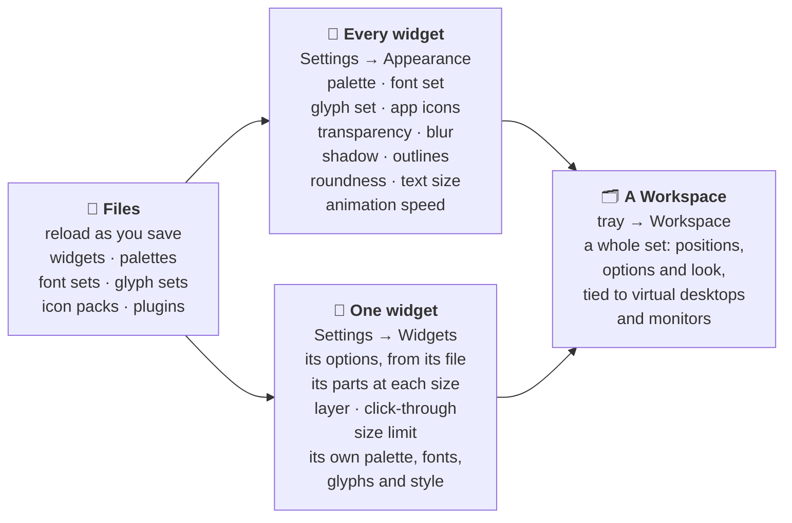
```mermaid
flowchart LR
    FILES["📄 <b>Files</b><br/>reload as you save<br/>widgets · palettes<br/>font sets · glyph sets<br/>icon packs · plugins"]
    ALL["🎨 <b>Every widget</b><br/>Settings → Appearance<br/>palette · font set<br/>glyph set · app icons<br/>transparency · blur<br/>shadow · outlines<br/>roundness · text size<br/>animation speed"]
    ONE["🧩 <b>One widget</b><br/>Settings → Widgets<br/>its options, from its file<br/>its parts at each size<br/>layer · click-through<br/>size limit<br/>its own palette, fonts,<br/>glyphs and style"]
    SETS["🗂️ <b>A Workspace</b><br/>tray → Workspace<br/>a whole set: positions,<br/>options and look,<br/>tied to virtual desktops<br/>and monitors"]
    FILES --> ALL
    FILES --> ONE
    ALL --> SETS
    ONE --> SETS
```

### Palettes

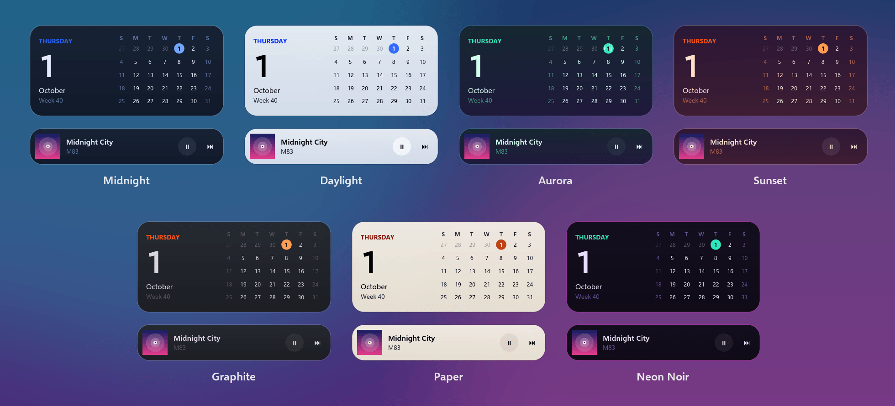

A palette is a short TOML file of colour tokens (`surface`, `text`, `accent`...). Pick one for every widget in **Settings → Appearance**, or give a single widget its own. Font sets and glyph sets work the same way, and are chosen independently of the palette.

<table>
<tr>
<td width="50%">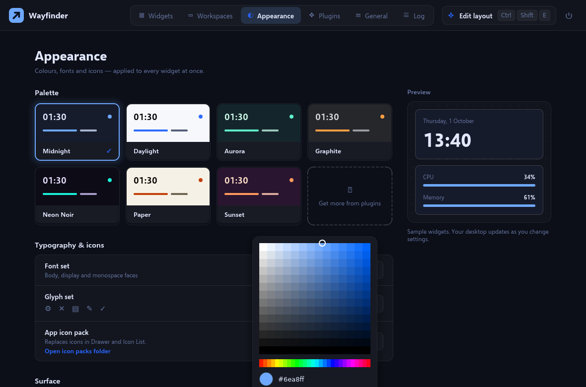</td>
<td width="50%">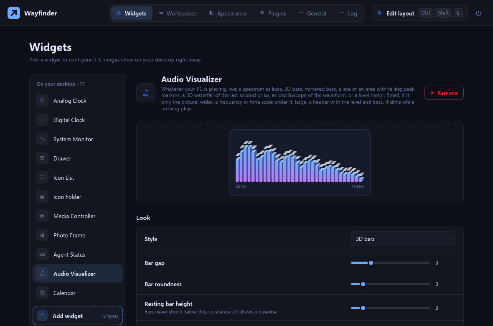</td>
</tr>
<tr>
<td align="center"><sub>Palettes, fonts, glyphs, icon packs and an accent picker</sub></td>
<td align="center"><sub>A widget's options are generated from the parameters its file declares</sub></td>
</tr>
</table>

### Which value wins

Every colour, font and corner radius a widget uses is a `$token`. Tokens are layered, and each layer can override the one before:

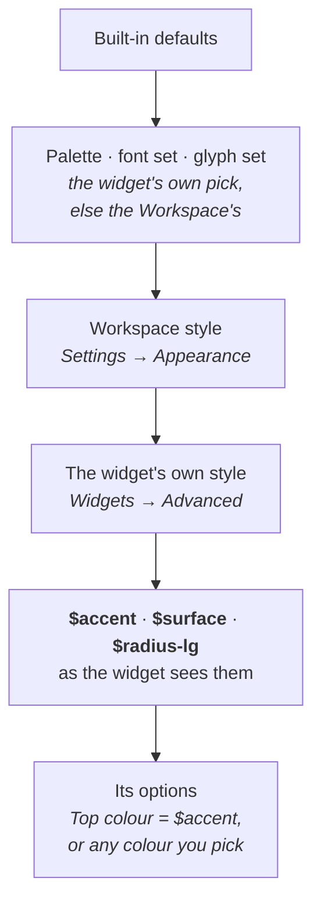
```mermaid
flowchart TB
    A["Built-in defaults"] --> B["Palette · font set · glyph set<br/><i>the widget's own pick,<br/>else the Workspace's</i>"]
    B --> C["Workspace style<br/><i>Settings → Appearance</i>"]
    C --> D["The widget's own style<br/><i>Widgets → Advanced</i>"]
    D --> E["<b>$accent</b> · <b>$surface</b> · <b>$radius-lg</b><br/>as the widget sees them"]
    E --> F["Its options<br/><i>Top colour = $accent,<br/>or any colour you pick</i>"]
```

So a red accent on one clock changes that clock only, a rounder style in Appearance rounds every widget that doesn't set its own, and an option set to a colour ignores the palette.

### The data folder

Everything lives in one folder (`%APPDATA%\Wayfinder`) and reloads as you save.

```text
Wayfinder/
├─ workspace.json        your Workspaces, arrangement and settings (written by the app)
├─ widgets/              *.toml  your own widgets, or copies of built-ins to change
├─ palettes/             *.toml  colour sets
├─ fonts/                *.toml font sets, plus .ttf / .otf files to make selectable
├─ glyphs/               *.toml  icon sets for buttons and chrome
├─ iconpacks/<name>/     chrome.png ...  replaces the icon of a matching app
├─ plugins/<id>/         installed plugins, each laid out like this folder
├─ THEMES.md             how to make palettes, font sets, glyph sets and icon packs
├─ PLUGINS.md            how to make and share a plugin
└─ .claude/skills/       Claude Code skills for making themes and plugins
```

Wayfinder writes `THEMES.md`, `PLUGINS.md` and their Claude Code skills at startup when they are missing, and never overwrites your edits. Run `claude` in the data folder and ask for a theme ("a warm sunset palette") or a plugin to have Claude Code write the files for you.

### Plugins

A plugin bundles widgets, palettes, font sets, glyph sets and icon packs: a folder laid out like the data folder, with a `plugin.toml`. Zip it and rename the zip to `.wfplugin` to share it.

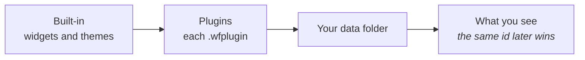
```mermaid
flowchart LR
    BI["Built-in<br/>widgets and themes"] --> PL["Plugins<br/>each .wfplugin"] --> YOU["Your data folder"]
    YOU --> SCR["What you see<br/><i>the same id later wins</i>"]
```

```toml
id = "sunset"
name = "Sunset"
version = "1.2.0"
author = "Ada"
description = "Warm evening colours and a weather card."
```

Double-click a `.wfplugin` (the first Wayfinder build to start takes `.wfplugin` files; **Settings → General → Plugin files** hands them to another), drop it on the Settings window or use **Install from file...** in **Settings → Plugins**, where each one can be switched off or removed. Because plugins load after the built-ins and before your own files, a plugin can restyle a built-in widget and your own copy still wins. Only content files unpack (`toml`, fonts, images, text, plus a `.wasm` module), and a widget can never launch anything inside `plugins/`. See `PLUGINS.md` in the data folder and [ADR-007](docs/adr/0007-content-plugins.md).

**Plugin code.** For live data (weather, feeds, a to-do list) a plugin can carry a **Code Source**: Rust compiled to WebAssembly with the [`wayfinder-plugin`](sdk/README.md) crate, run in the wasmi interpreter on its own thread. Its widgets bind to it like any other data (`{weather.temp}`, `on_click = "weather.refresh"`). It may reach only the HTTPS hosts its `plugin.toml` lists, read only the folders it lists, keep 1 MB of saved data, and must answer within a time and memory budget. It cannot write files or start programs, and has no WASI. [`sdk/examples/weather`](sdk/examples/weather) is a complete plugin; see [ADR-008](docs/adr/0008-plugin-code.md).

<br>

## 🗂️ Workspaces

A Workspace is a whole set of widgets with its own positions, options and look. Switch from the tray's **Workspace** menu or **Settings → Workspaces**, where you can add an empty one or duplicate the one on screen, rename and remove them, and tie one to:

- **virtual desktops** (`Win` + `Ctrl` + `D`): going to one of them brings that Workspace up;
- **a monitor setup**: connecting those monitors brings it up, so a laptop can have one set alone and another docked. A dock that renumbers its monitors still counts.

<table>
<tr>
<td width="55%">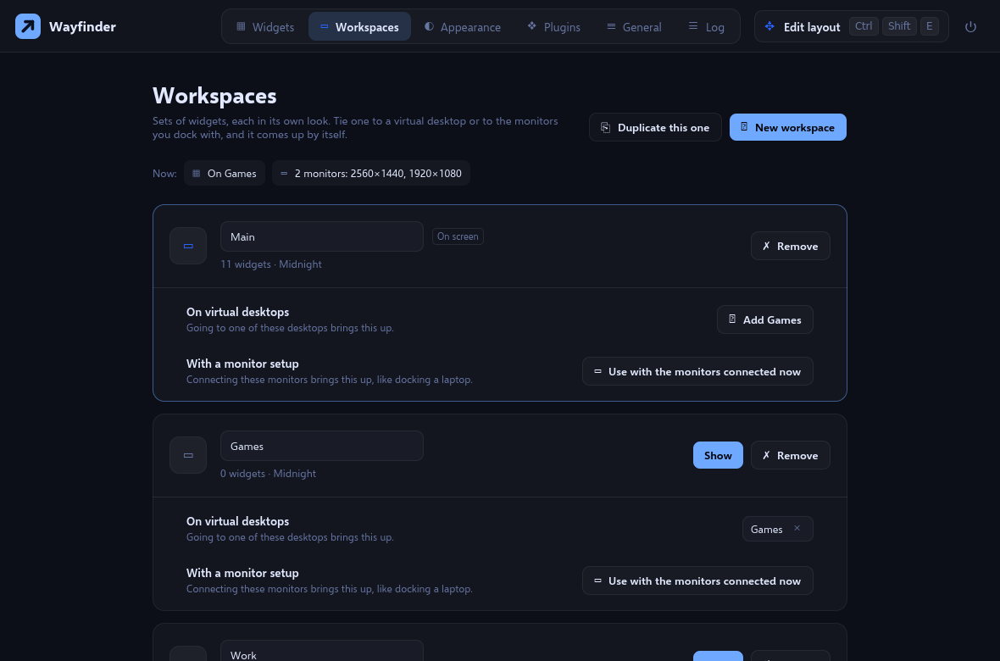</td>
<td width="45%" valign="top">

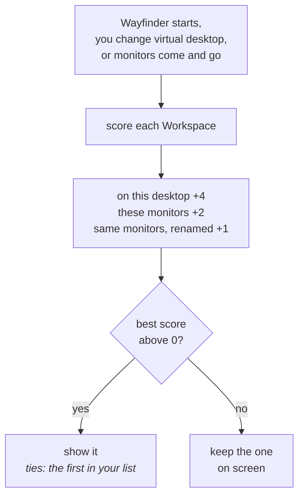
```mermaid
flowchart TD
    E["Wayfinder starts,<br/>you change virtual desktop,<br/>or monitors come and go"] --> SC["score each Workspace"]
    SC --> R["on this desktop +4<br/>these monitors +2<br/>same monitors, renamed +1"]
    R --> BEST{"best score<br/>above 0?"}
    BEST -- yes --> SW["show it<br/><i>ties: the first in your list</i>"]
    BEST -- no --> KEEP["keep the one<br/>on screen"]
```

</td>
</tr>
</table>

The most specific match wins, a Workspace with no ties only comes up when you pick it, and one you pick stays until you go to another desktop or connect other monitors. Theme and style belong to each Workspace; GPU, startup, grid and plugins are shared. Virtual desktops are read from where Explorer keeps them, as PowerToys does; see [ADR-011](docs/adr/0011-workspaces-follow-desktops-and-monitors.md).

<br>

## ✍️ Write a widget

A widget is one TOML file in `widgets/`. Save it and it appears in **Add a widget**:

```toml
name = "My Clock"
category = "Time"               # groups it in Settings > Add a widget
icon = "clock"                  # a glyph set's glyph-* name, shown beside it
size = [240, 120]
min_size = [160, 80]            # Edit Mode resizes within these;
max_size = [480, 240]           # a widget's "Size limit" switch lifts the max

[params.accent]                 # becomes a colour picker in Settings
type = "color"
default = "$accent"
label = "Accent"

[root]
fill = ["$surface", "$surface-2"]    # $tokens come from the active theme
radius = "$radius-lg"
align = "center"
justify = "center"

  [[root.children]]
  type = "text"
  text = "{pad(clock.hour, 2)}:{pad(clock.minute, 2)}"     # live binding
  size = "{min(self.h * 0.5, self.w * 0.2)}"               # scales with the window
  color = "{param.accent}"

  [[root.children]]
  when = "{self.h >= 200}"                                 # only when there is room
  type = "text"
  text = "{clock.date}"
  color = "$text-dim"
```

<details>
<summary><b>Reference: elements, attributes and expressions</b></summary>

<br>

**Elements:** `box` · `text` · `image` · `hand` · `ticks` · `arc` · `graph` (a line through `values`, `span` slots wide, from `min` to `max`, with an `area` under it as see-through as `area_opacity`) · `block` (a 3D block, `depth` px deep, fading from `color` to `color_bottom`) · `repeat` (one child per list item) · `slot` (the box arranged Modules fill).

| Group | Attributes |
|---|---|
| Layout (flexbox) | `direction` `wrap` `align` `justify` `gap` `padding` `margin` `width` `height` `min_*` `max_*` `grow` `shrink` `basis` `aspect` `position` `inset` |
| Look | `fill` (or `[top, bottom]` gradient) `border` `border_color` `radius` `shadow` `opacity` `clip` |
| Text | `text` `size` `color` `font` `weight` `text_align` `text_wrap` `line_height` |
| Image | `src` (PNG, JPEG, WebP, GIF, BMP; `./` is next to the widget file, or a full path like `{item.target}`) `tint` `fit` (`contain` · `cover`) `feather` (fade the edge over that many px, inside `radius`) `max` (a small copy made off the UI thread and cached; use it for photo grids) `anim` (`false` stops a GIF, WebP or APNG) `frame` (show one frame) `fade` (crossfade a new `src` in over that many ms) |
| Behaviour | `on_click` (`launch <path>` · `toggle <state>` · `set <state> <value>` · `param <name> <value>` saves a setting) `on_drop` (a dropped file's path follows the action) `on_slide` (a bar to drag: `state.slide` is 0-1 while dragging, and letting go runs the action with the fraction after it, `media.seek 0.42`) `hover` `transition` `enter` `scroll` `scroll_x` `when` |

An optional colour that evaluates to `nil` is left out: `area = "{on ? '$accent' : nil}"`.

**Data you can bind to:** `clock.*` (hour, minute, second, date, angles for hands, and `clock.zones` for a `cities` param) · `sys.*` (gauges, `gauges_all`, `graphs`, `gpus` (one per adapter: `label` `value` `history`), `gpu_count`, `cpu_history`, `ram_history`, `net_history`, `net_down`, `net_up`, uptime) · `shortcuts.items` · `media.*` (what any app plays through the system media controls: `title` `artist` `album` `source` `playing` `can_seek` `art` `position` `duration` `progress` `clock` `length` `active`; `on_click = "media.play_pause"`, `media.next`, `media.prev`, and `media.seek <0-1>` from an `on_slide` bar) · `audio.*` (what the speakers play, for visualizers: `bands` `peaks` `level` `bass`, the waveform `wave` (-1 to 1, starting where it rises through zero, scaled to fit), `history` (the bands of the last 1.4 s, a row every 60 ms, oldest first) and `active`, shaped by the widget's `bands` `fmin` `fmax` `gain` `attack` `release` `peak_fall` `timebase` params) · `gallery.*` (the pictures in the widget's `folder`: `items` (`name` `path` `ext` `size` `modified_ms` `date`) `count` `folder_name` `error` `truncated`, and the slide a frame shows, `index` and `current`, which move on every `interval` seconds and with `gallery.next` / `gallery.prev`; `on_drop = "gallery.drop"` makes a dropped folder, or a dropped photo's folder, the widget's) · `calendar.*` (the month around today: `weeks` (`week`, the ISO number, and `days`: `day` `this_month` `today` `weekend`) `day_names` `day_letters` `month_name` `year` `day` `weekday` `week`) · `agents.*` (Claude Code, Copilot CLI and Antigravity CLI sessions for the widget's `provider`: `items` (`name` `cwd` `tool` `label` `working` `done` `age`) `count` `working`) · `param.*` · `state.*` · `self.w` / `self.h`.

**Size tiers** are plain `when` conditions on `self.w` and `self.h`: show more when there is room. The engine animates the change.

**Modules** let the user arrange a widget in Settings: the widget on top, a tab per size, and the parts dragged between slots or into a Hidden tray. A file opts in by declaring what can move:

```toml
[tiers.compact]                       # first tier whose `when` holds; one without `when` is the fallback
size = [240, 130]                     # what Settings previews the tab at
when = "{self.w < 260}"
layout = { bars = ["gauge:cpu", "gauge:gpu*"] }   # the default: slot -> modules (`*` matches a prefix)
[tiers.normal]
layout = { gauges = ["gauge:cpu", "gauge:gpu*"] }
[slots.bars]
[slots.gauges]
[modules.gauge]                       # a Module is a box, or any element; `for` makes one per item
for = "{sys.gauges_all}"
as = "g"
key = "{g.key}"                       # ids are `gauge:<key>`
slots = ["bars", "gauges"]            # where it may be dropped
when = "{sys.has_battery}"            # optional: whether it exists at all
label = "{g.label}"
direction = "{slot == 'bars' ? 'row' : 'column'}"   # `tier` and `slot` are available inside
[root]
[[root.children]]
type = "slot"                         # the box the arranged modules fill
slot = "gauges"
when = "{tier != 'compact'}"
max = "{floor((self.w - 28) / 50)}"   # optional: how many fit; the rest are left out, not overflowed
```

A `[params.x]` with `module = "gauge:cpu,graph:cpu"` shows in Settings only while one of those modules is selected; without it, it is an option of the whole widget. `legacy = { "gauge:cpu" = "show_cpu" }` on a module turns an old saved `show_cpu = false` into a layout without it.

**Expressions** are total: arithmetic, comparison, `&&` `||` `!`, `? :`, strings and the functions `min` `max` `abs` `round` `floor` `ceil` `clamp` `len` `upper` `lower` `pad` `at` `clock`. `clock(secs)` reads seconds as a player shows them, `3:07` or `1:02:03`. `at(list, i)` picks by a computed position (negative counts from the end, past the end is nothing) or key, and takes a field after it: `at(gallery.items, state.selected).url`. There are no loops and no side effects, so evaluating one can never hang a redraw. Interpolate with `{expr}` or format with `{expr|02}` / `{expr|.1}`.

Unknown attributes are rejected with a suggestion, for example ``unknown attribute `colour` on `text` (did you mean `color`?)``.

**Params** become Settings controls: `type` (`color` · `font` · `number` · `enum` · `bool` · `string` · `folder` · `file` · `duration` · `shortcuts`), `default`, `label`, `help`, `min` / `max` / `step`, and for an `enum` its `choices`, plain strings or `{ value = "fast", label = "Fast (30 fps)" }`. Params with the same `group = "Motion"` get their own heading.

**Needs:** `needs = ["weather"]` names the data sources a widget cannot work without. When one is missing, the widget and Settings say which, instead of showing a blank card.

**Seeds:** `seed = "starter-apps"` on a `shortcuts` param gives each new Instance a few apps to start from. Unlike `default`, a seed is written once and then edited like any other value.

</details>

<br>

## ⚙️ How it works

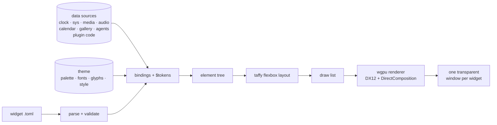
```mermaid
flowchart LR
    T["widget .toml"] --> P["parse + validate"]
    D[("data sources<br/>clock · sys · media · audio<br/>calendar · gallery · agents<br/>plugin code")] --> B["bindings + $tokens"]
    TH[("theme<br/>palette · fonts · glyphs · style")] --> B
    P --> B
    B --> N["element tree"]
    N --> L["taffy flexbox layout"]
    L --> DL["draw list"]
    DL --> R["wgpu renderer<br/>DX12 + DirectComposition"]
    R --> W["one transparent<br/>window per widget"]
```

The settings window is built from the same element tree in Rust, so widgets and settings share **one layout path and one renderer**. The renderer only ever sees a flat draw list, so it can be swapped without touching anything above it.

**Why idle costs nothing.** Every data source says, field by field, when what it reports can next change. Wayfinder sleeps until the earliest of those moments, or until a source says something happened:

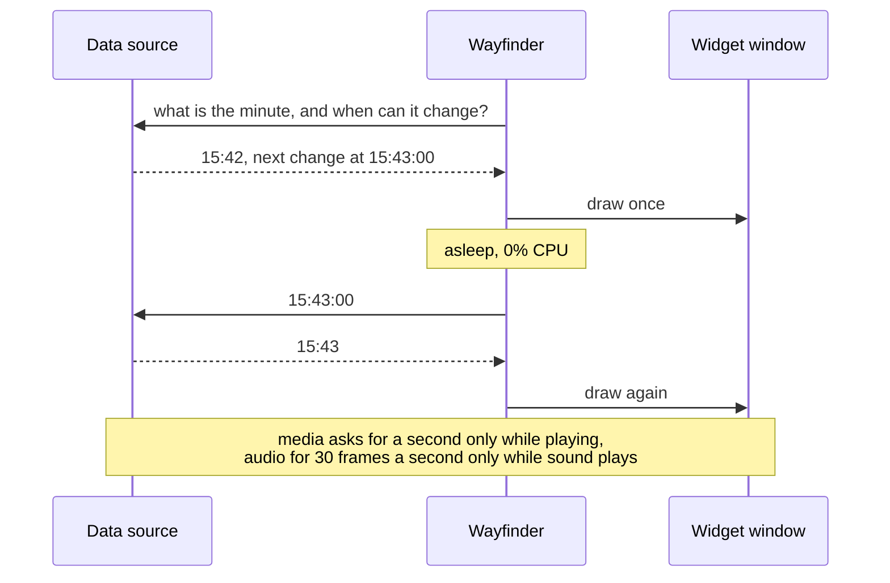
```mermaid
sequenceDiagram
    participant S as Data source
    participant A as Wayfinder
    participant W as Widget window
    A->>S: what is the minute, and when can it change?
    S-->>A: 15:42, next change at 15:43:00
    A->>W: draw once
    Note over A: asleep, 0% CPU
    A->>S: 15:43:00
    S-->>A: 15:43
    A->>W: draw again
    Note over S,W: media asks for a second only while playing,<br/>audio for 30 frames a second only while sound plays
```

| | |
|---|---|
| `src/widgets/` | the Widget seam: TOML and Rust Widgets, the registry, the build pipeline |
| `src/content.rs` `plugins.rs` | the Catalog: content from the built-ins, each Plugin and the data folder, in that order; installing and removing Plugins |
| `src/code/` `net.rs` | Code Sources: the wasmi runtime, the worker and its schedule, plugin data, and the HTTPS policy |
| `sdk/` | the `wayfinder-plugin` crate for writing plugin code, and a weather example |
| `src/format.rs` `expr.rs` | TOML widget format and the total expression language |
| `src/elements/` | one file per element kind: its attributes, build and drawing |
| `src/data/` | one file per Data Source (`clock`, `calendar`, `sys`, `shortcuts`, `media`, `audio`, `gallery`, `agents`) and how often it changes |
| `src/card.rs` | the card inside each window: shadow gutter, blur, outlines |
| `src/ui.rs` `text.rs` `anim.rs` | element tree, taffy layout, text shaping (glyphon), declarative transitions |
| `src/gfx.rs` `draw.rs` `shader.wgsl` | wgpu renderer, SDF shapes, premultiplied alpha |
| `src/app/` `edit.rs` `workspace.rs` | windows, scheduling, input, Edit Mode, Workspaces, Show Desktop, persistence and monitor anchoring |
| `src/settings.rs` | the animated settings window |
| `src/platform/` | window styles, z-order, Show Desktop, monitors, virtual desktops |

### Decisions worth knowing

Each one is written up with its measurements in [`docs/adr/`](docs/adr).

| | |
|---|---|
| [DirectX 12 + DirectComposition](docs/adr/0001-dx12-dcomp-presentation.md) | The only path on Windows that gives real per-pixel window alpha. A plain swapchain reports `Opaque` only, and Vulkan's support varies by driver. |
| [Z-order like Rainmeter](docs/adr/0002-z-order-by-reassertion.md) | Widgets sit just above the desktop layer. A hidden sentinel window tells Show Desktop from normal. Nothing is reparented into the shell. |
| [No Wallpaper Engine integration](docs/adr/0003-no-wallpaper-engine-integration.md) | It exposes no API, so there is nothing to integrate with. |
| [Declarative animation](docs/adr/0004-declarative-animation.md) | The engine owns the clock, so it always knows whether anything is animating, which is what makes "free when idle" possible. |
| [Adapter and present mode](docs/adr/0005-adapter-and-present-mode.md) | `Mailbox` presentation, and the integrated GPU by default (see below). |
| [Swapchain sizing and GPU loss](docs/adr/0006-swapchain-resize-and-gpu-loss.md) | Resizing a composition swapchain every frame is fragile, so it is sized in buckets, and a lost device is rebuilt. |
| [Content plugins](docs/adr/0007-content-plugins.md) | A `.wfplugin` is a zip that installs by unpacking. Widget ids stay flat, so a plugin can restyle built-ins. No native code. |
| [Plugin code](docs/adr/0008-plugin-code.md) | WebAssembly Code Sources in wasmi, one thread per plugin, a JSON ABI, HTTPS to listed hosts, read-only folders it declares and 1 MB of saved data. The UI never waits for plugin code. |
| [Native sources in your own build](docs/adr/0009-native-sources-in-your-own-build.md) | Native code joins through an exe built on the engine as a library, never through DLLs. |
| [Workspaces follow desktops and monitors](docs/adr/0011-workspaces-follow-desktops-and-monitors.md) | The current virtual desktop comes from Explorer's registry keys, watched without polling; if they move, desktop rules quietly stop applying. |

> [!IMPORTANT]
> **Which GPU?** Wayfinder defaults to the **integrated** GPU (`"gpu": "low"`). On the AMD machine it was developed on, selecting the dedicated GPU pinned one CPU core at 99% while idle with two or more widgets on screen, in a driver thread outside Wayfinder, whereas the integrated GPU idled at 0.00%. Widgets are tiny, so the integrated GPU is plenty. Change it in **Settings → General**, or set `"gpu": "high"` in `workspace.json`. `"software"` renders on the CPU. Details in [ADR-005](docs/adr/0005-adapter-and-present-mode.md).

<br>

## 📊 Status

**Alpha.** It works and is tested, but it is young.

<table>
<tr>
<td width="50%" valign="top">

**✅ Verified**

- 329 unit tests (`cargo test --lib`), pure logic, no GPU
- Every built-in widget, at each size it allows, checked to build and fit without text cut off
- Every widget and the settings window rendered offscreen
- A 35-check scripted run of the live app on the **software** renderer: drag, live resize, undo, saving, folder expand, hot reload with error cards, the settings commands, and Show Desktop against a stand-in host window

</td>
<td width="50%" valign="top">

**⚠️ Not verified yet**

- The windowed app on a real GPU after the swapchain fix ([ADR-006](docs/adr/0006-swapchain-resize-and-gpu-loss.md))
- Show Desktop against the real Explorer (`Win` + `D`)
- Workspaces on a real desktop: reading virtual desktops, the tray submenu, docking
- The audio visualizer with real music: capture, the oscilloscope's trigger and scale
- Fullscreen games, mixed DPI, monitor hot-unplug
- Vulkan and OpenGL (`WAYFINDER_BACKEND`) are for experiments only

</td>
</tr>
</table>

**Ideas, not promises:** a plugin catalogue to browse and install from, shader widgets, an installer.

<br>

## 🛠️ Development

```powershell
cargo test --lib                     # 329 unit tests, pure logic, no GPU
cargo run --release -- --selftest --gpu software --data $env:TEMP\wf-test
```

Offscreen renders, on the software adapter by default:

```powershell
cargo run --release --example render_widgets  -- docs\img\widgets.png
cargo run --release --example render_settings -- docs\img
```

### Extend it

Each kind of extension is one file plus one line of registration:

| To add | Write | Register |
|---|---|---|
| a built-in TOML widget | `assets/widgets/<id>.toml` | nothing: `build.rs` finds it |
| a Rust widget | `src/widgets/<id>.rs` implementing `Widget` (the Drawer is the example) | `registry.rs` |
| a data source | `src/data/<name>.rs` implementing `DataSource`, with the cadence of each field | `DataSources::builtin` |
| a data source in your own build | a `DataSource` in a crate that depends on `wayfinder` | `Options.extra_sources` before `wayfinder::run` |
| an element kind | `src/elements/<name>.rs` with a `KIND` and, if it draws, a `Shape` | `elements::KINDS` |
| a Workspace-wide style switch | a `Flag` variant and its `Workspace` field | a `flag_row` in Settings |
| widgets and themes to share | a folder with `plugin.toml` in `<data>/plugins/` (see `assets/guides/PLUGINS.md`) | nothing: it loads as you save |
| live data from a plugin | a Rust crate on [`wayfinder-plugin`](sdk/README.md), built for `wasm32-unknown-unknown` | a `[code]` table in its `plugin.toml` |

**Your own build.** The engine is a library: an app can add native data sources and ship its own exe. A source says it changed through the `Notifier` it is given in `attach`, handles `on_click = "media.play_pause"` in `act`, saves a widget's setting with `Notifier::set_param`, frees per-widget state in `retain`, and gives a `cadence(field, cx)` that may follow its state (`Second` while playing, `None` while paused):

```rust
fn main() {
    let mut o = wayfinder::Options::from_args();
    o.extra_sources.push(Box::new(media::Media::default()));
    wayfinder::run(o);
}
```

**Command line for authors.** These print to the console and exit. Wayfinder is a Windows app, so pipe its output (`| Out-Host`) for the shell to wait for it and set `$LASTEXITCODE`:

```powershell
wayfinder --render-widget sunset_weather --png out.png --size 300x200 --param city=Oslo --time 15:42   # also a path to a .toml
wayfinder plugin pack plugins\sunset            # sunset.wfplugin next to the folder, checked
wayfinder plugin check sunset.wfplugin          # 0 when it installs and loads cleanly, 1 with problems
```

`--render-widget` renders through the real pipeline on the software adapter, with plugin code running (`--wait` seconds for its first answer), so CI can check widgets without a desktop. `wayfinder::plugins::{describe, check, pack}` do the same from Rust; `describe` is a stable API.

### Commit messages

Conventional Commits, Angular style: `type(scope): short summary`, imperative, lower case, no trailing period, under ~50 characters. Types: `feat`, `fix`, `docs`, `style`, `refactor`, `perf`, `test`, `build`, `ci`, `chore`. Keep the body to a line or two, only when the why isn't obvious. Example: `feat(drawer): add blur and tint options`.

> [!WARNING]
> `examples/phase0_spike.rs` is kept only as the record of the early measurements. **Do not run it**: it stress-tests multi-window swapchains and, together with the bug fixed in ADR-006, crashed an AMD driver during development.

<br>

## 🙏 Credits

Inspired by [Rainmeter](https://www.rainmeter.net) and the Windows Vista and 7 sidebar gadgets. Built on
[wgpu](https://wgpu.rs), [winit](https://github.com/rust-windowing/winit), [taffy](https://github.com/DioxusLabs/taffy),
[glyphon](https://github.com/grovesNL/glyphon), [`windows`](https://github.com/microsoft/windows-rs),
[tray-icon](https://github.com/tauri-apps/tray-icon), [notify](https://github.com/notify-rs/notify),
[global-hotkey](https://github.com/tauri-apps/global-hotkey), [rustfft](https://github.com/ejmahler/RustFFT) and
[wasmi](https://github.com/wasmi-labs/wasmi).

<div align="center">
<br>
<sub>No license has been chosen yet. Until one is added, all rights are reserved.</sub>
</div>
