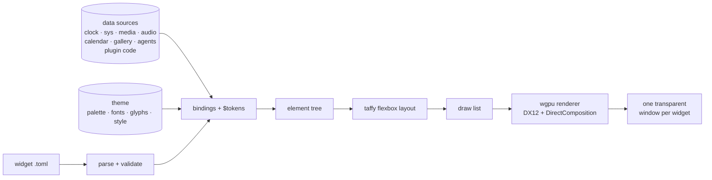
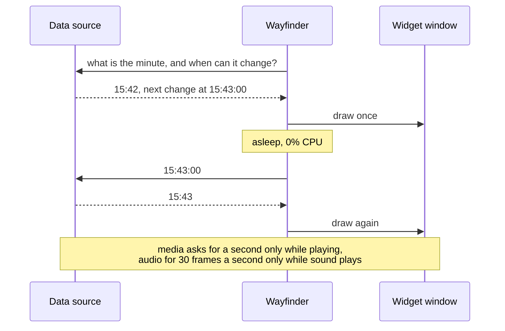

<!-- nav:start -->
[🧭 Wayfinder](../README.md) · [Using it](using.md) · [Widgets](widgets.md) · [Visualizer](visualizer.md) · [Make it yours](customizing.md) · [Workspaces](workspaces.md) · [Plugins](plugins.md) · [Write a widget](writing-widgets.md) · **How it works** · [Development](development.md)
<!-- nav:end -->

# ⚙️ How it works

How a widget file becomes pixels, why idle costs nothing, where the code lives, and the decisions behind it.

## From TOML to pixels

The settings window is built from the same element tree in Rust, so widgets and settings share **one layout path and one renderer**. The renderer only ever sees a flat draw list, so it can be swapped without touching anything above it.

## Why idle costs nothing

Every data source says, field by field, when what it reports can next change. Wayfinder sleeps until the earliest of those moments, or until a source says something happened:

## Where the code lives

| | |
|---|---|
| `src/widgets/` | the Widget seam: TOML and Rust Widgets, the registry, the build pipeline |
| `src/content.rs` `plugins.rs` | the Catalog: content from the built-ins, each Plugin and the data folder, in that order; installing and removing Plugins |
| `src/code/` `net.rs` | Code Sources: the wasmi runtime, the worker and its schedule, plugin data, and the HTTPS policy |
| `sdk/` | the `wayfinder-plugin` crate for writing plugin code, and a weather example |
| `src/format.rs` `expr.rs` | TOML widget format and the total expression language |
| `src/elements/` | one file per element kind: its attributes, build and drawing |
| `src/data/` | one file per Data Source (`clock`, `calendar`, `sys`, `shortcuts`, `media`, `audio`, `gallery`, `agents`) and how often it changes |
| `src/card.rs` | the card inside each window: shadow gutter, blur, outlines |
| `src/ui.rs` `text.rs` `anim.rs` | element tree, taffy layout, text shaping (glyphon), declarative transitions |
| `src/gfx.rs` `draw.rs` `shader.wgsl` | wgpu renderer, SDF shapes, premultiplied alpha |
| `src/app/` `edit.rs` `workspace.rs` | windows, scheduling, input, Edit Mode, Workspaces, Show Desktop, persistence and monitor anchoring |
| `src/settings.rs` | the animated settings window |
| `src/platform/` | window styles, z-order, Show Desktop, the icon layer, monitors, virtual desktops |

## Decisions worth knowing

Each one is written up with its measurements in [`docs/adr/`](adr).

| | |
|---|---|
| [DirectX 12 + DirectComposition](adr/0001-dx12-dcomp-presentation.md) | The only path on Windows that gives real per-pixel window alpha. A plain swapchain reports `Opaque` only, and Vulkan's support varies by driver. |
| [Z-order like Rainmeter](adr/0002-z-order-by-reassertion.md) | Widgets sit just above the desktop layer. A hidden sentinel window tells Show Desktop from normal. Nothing is reparented into the shell, except behind the icons (below). |
| [No Wallpaper Engine integration](adr/0003-no-wallpaper-engine-integration.md) | It exposes no API, so there is nothing to integrate with. |
| [Declarative animation](adr/0004-declarative-animation.md) | The engine owns the clock, so it always knows whether anything is animating, which is what makes "free when idle" possible. |
| [Adapter and present mode](adr/0005-adapter-and-present-mode.md) | `Mailbox` presentation, and the integrated GPU by default (see below). |
| [Swapchain sizing and GPU loss](adr/0006-swapchain-resize-and-gpu-loss.md) | Resizing a composition swapchain every frame is fragile, so it is sized in buckets, and a lost device is rebuilt. |
| [Content plugins](adr/0007-content-plugins.md) | A `.wfplugin` is a zip that installs by unpacking. Widget ids stay flat, so a plugin can restyle built-ins. No native code. |
| [Plugin code](adr/0008-plugin-code.md) | WebAssembly Code Sources in wasmi, one thread per plugin, a JSON ABI, HTTPS to listed hosts, read-only folders it declares and 1 MB of saved data. The UI never waits for plugin code. |
| [Native sources in your own build](adr/0009-native-sources-in-your-own-build.md) | Native code joins through an exe built on the engine as a library, never through DLLs. |
| [Workspaces follow desktops and monitors](adr/0011-workspaces-follow-desktops-and-monitors.md) | The current virtual desktop comes from Explorer's registry keys, watched without polling; if they move, desktop rules quietly stop applying. |
| [Velopack installer and auto-update](adr/0012-velopack-installer-and-autoupdate.md) | A `Setup.exe` installs to `%LocalAppData%\Wayfinder`; a background thread downloads updates and Velopack applies them silently on the next launch. `%APPDATA%\Wayfinder` is untouched. |
| [Behind the desktop icons](adr/0013-behind-icons-by-reparenting.md) | The one exception to ADR-0002: a widget becomes a child of Explorer's icon layer, the way wallpaper apps do it. It can only be looked at, since the icons take the mouse; Edit Mode lifts it out to be moved. |

<!-- pager:start -->
 

---

<table width="100%"><tr><td><a href="writing-widgets.md">← ✍️ Write a widget</a></td><td align="right"><a href="development.md">🛠️ Development →</a></td></tr></table>
<!-- pager:end -->
