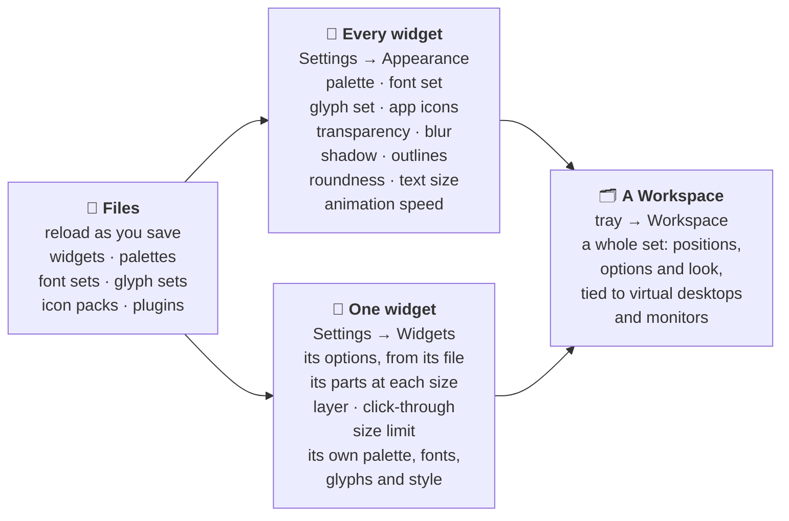
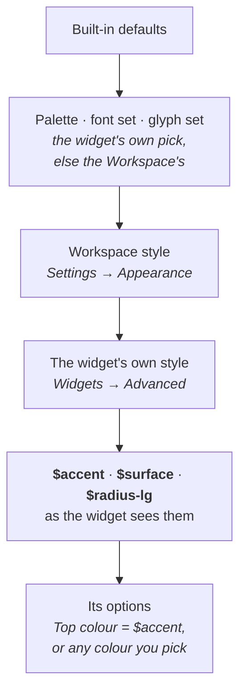

<!-- nav:start -->
<sub>[🧭 Wayfinder](../README.md) · [Using it](using.md) · [Widgets](widgets.md) · [Visualizer](visualizer.md) · **Make it yours** · [Workspaces](workspaces.md) · [Plugins](plugins.md) · [Write a widget](writing-widgets.md) · [How it works](architecture.md) · [Development](development.md)</sub>
<!-- nav:end -->

# 🎨 Make it yours

Colours, fonts, icons and style, for every widget at once or for one. To bundle what you make and share it, see [Plugins](plugins.md); to change what a widget shows, [Write a widget](writing-widgets.md).

## What you can change, and where



## Palettes


A palette is a short TOML file of colour tokens (`surface`, `text`, `accent`...). Pick one for every widget in **Settings → Appearance**, or give a single widget its own. Font sets and glyph sets work the same way, and are chosen independently of the palette.

<table>
<tr>
<td width="50%"></td>
<td width="50%"></td>
</tr>
<tr>
<td align="center"><sub>Palettes, fonts, glyphs, icon packs and an accent picker</sub></td>
<td align="center"><sub>A widget's options are generated from the parameters its file declares</sub></td>
</tr>
</table>

## Which value wins

Every colour, font and corner radius a widget uses is a `$token`. Tokens are layered, and each layer can override the one before:



So a red accent on one clock changes that clock only, a rounder style in Appearance rounds every widget that doesn't set its own, and an option set to a colour ignores the palette.

## The data folder

Everything lives in one folder (`%APPDATA%\Wayfinder`) and reloads as you save.

```text
Wayfinder/
├─ workspace.json        your Workspaces, arrangement and settings (written by the app)
├─ widgets/              *.toml  your own widgets, or copies of built-ins to change
├─ palettes/             *.toml  colour sets
├─ fonts/                *.toml font sets, plus .ttf / .otf files to make selectable
├─ glyphs/               *.toml  icon sets for buttons and chrome
├─ iconpacks/<name>/     chrome.png ...  replaces the icon of a matching app
├─ plugins/<id>/         installed plugins, each laid out like this folder
├─ THEMES.md             how to make palettes, font sets, glyph sets and icon packs
├─ PLUGINS.md            how to make and share a plugin
└─ .claude/skills/       Claude Code skills for making themes and plugins
```

Wayfinder writes `THEMES.md`, `PLUGINS.md` and their Claude Code skills at startup when they are missing, and never overwrites your edits. Run `claude` in the data folder and ask for a theme ("a warm sunset palette") or a plugin to have Claude Code write the files for you.

<!-- pager:start -->
<br>

---

<table width="100%"><tr><td><a href="visualizer.md">← 🎚️ The audio visualizer</a></td><td align="right"><a href="workspaces.md">🗂️ Workspaces →</a></td></tr></table>
<!-- pager:end -->
