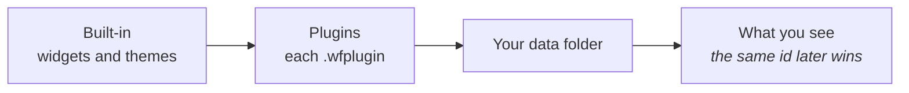

<!-- nav:start -->
<sub>[🧭 Wayfinder](../README.md) · [Using it](using.md) · [Widgets](widgets.md) · [Visualizer](visualizer.md) · [Make it yours](customizing.md) · [Workspaces](workspaces.md) · **Plugins** · [Write a widget](writing-widgets.md) · [How it works](architecture.md) · [Development](development.md)</sub>
<!-- nav:end -->

# 🧩 Plugins

Share widgets, palettes, fonts and icons as one file, and give widgets live data from your own code.

## What a plugin is

A plugin bundles widgets, palettes, font sets, glyph sets and icon packs: a folder laid out like the data folder, with a `plugin.toml`. Zip it and rename the zip to `.wfplugin` to share it. [`assets/guides/PLUGINS.md`](../assets/guides/PLUGINS.md), which Wayfinder also writes into your data folder, has every rule.



```toml
id = "sunset"
name = "Sunset"
version = "1.2.0"
author = "Ada"
description = "Warm evening colours and a weather card."
```

## Install and share

Double-click a `.wfplugin` (the first Wayfinder build to start takes `.wfplugin` files; **Settings → General → Plugin files** hands them to another), drop it on the Settings window or use **Install from file...** in **Settings → Plugins**, where each one can be switched off or removed. Because plugins load after the built-ins and before your own files, a plugin can restyle a built-in widget and your own copy still wins. Only content files unpack (`toml`, fonts, images, text, plus a `.wasm` module), and a widget can never launch anything inside `plugins/`. See `PLUGINS.md` in the data folder and [ADR-007](adr/0007-content-plugins.md).

## Plugin code

For live data (weather, feeds, a to-do list) a plugin can carry a **Code Source**: Rust compiled to WebAssembly with the [`wayfinder-plugin`](../sdk/README.md) crate, run in the wasmi interpreter on its own thread. Its widgets bind to it like any other data (`{weather.temp}`, `on_click = "weather.refresh"`). It may reach only the HTTPS hosts its `plugin.toml` lists, read only the folders it lists, keep 1 MB of saved data, and must answer within a time and memory budget. It cannot write files or start programs, and has no WASI. [`sdk/examples/weather`](../sdk/examples/weather) is a complete plugin; see [ADR-008](adr/0008-plugin-code.md).

<!-- pager:start -->
<br>

---

<table width="100%"><tr><td><a href="workspaces.md">← 🗂️ Workspaces</a></td><td align="right"><a href="writing-widgets.md">✍️ Write a widget →</a></td></tr></table>
<!-- pager:end -->
