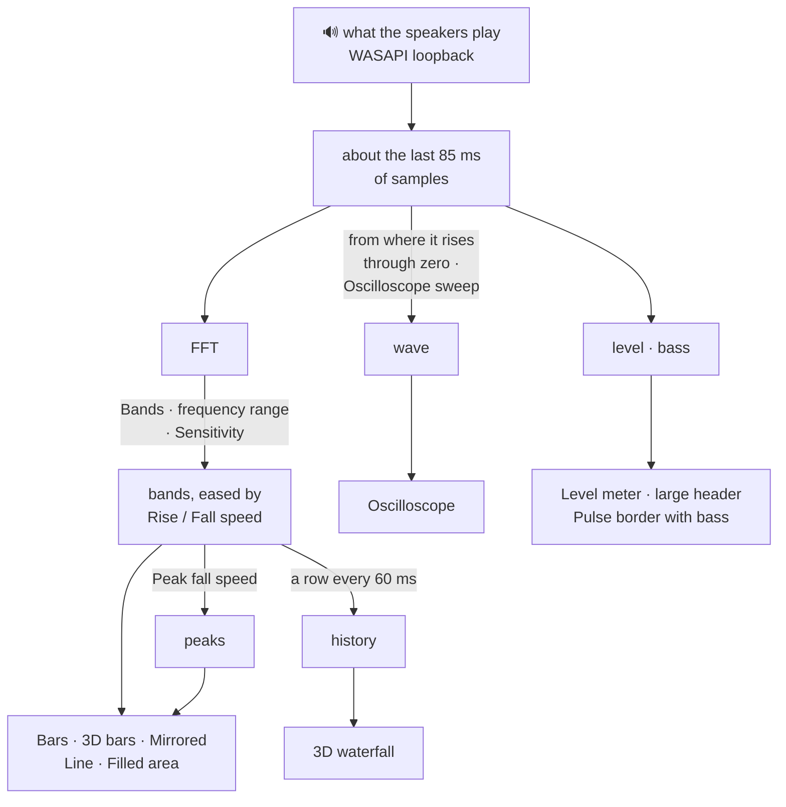

<!-- nav:start -->
[🧭 Wayfinder](../README.md) · [Using it](using.md) · [Widgets](widgets.md) · **Visualizer** · [Make it yours](customizing.md) · [Workspaces](workspaces.md) · [Plugins](plugins.md) · [Write a widget](writing-widgets.md) · [How it works](architecture.md) · [Development](development.md)
<!-- nav:end -->

# 🎚️ The audio visualizer

The Audio Visualizer shows what your speakers play, live. Pick its style in **Settings → Widgets → Audio Visualizer → Style**.

## Eight styles

## How sound becomes a picture

It listens to what your speakers play (WASAPI loopback, nothing leaves your PC) only while a visualizer is on screen, and stops a few seconds after. While nothing plays it fades to the opacity you choose and costs nothing.

## Options

| Style | What you see | Its own options |
|---|---|---|
| **Bars**, **Mirrored bars** | a spectrum from low to high frequencies, peaks falling slowly | bar gap, roundness, resting height |
| **3D bars** | the same as blocks with a lit top and a shaded side, peaks as floating lids | **3D depth** |
| **Line**, **Filled area** | the spectrum as a line, with the peaks as a second, thin one | line thickness |
| **3D waterfall** | the last 1.4 s of spectra going back into the distance, nearer ones hiding those behind | line thickness |
| **Oscilloscope** | the waveform itself, held still on a steady note like a real scope, scaled to fit, on a faint grid | **sweep** (5–40 ms), grid |
| **Level meter** | how loud, and how much bass | |

Every style also takes the colours (top and bottom of a bar), the number of bands, the frequency range, sensitivity, rise and fall speed, and whether the card has a background.

<!-- pager:start -->
 

---

<table width="100%"><tr><td><a href="widgets.md">← 🧩 The widgets</a></td><td align="right"><a href="customizing.md">🎨 Make it yours →</a></td></tr></table>
<!-- pager:end -->
