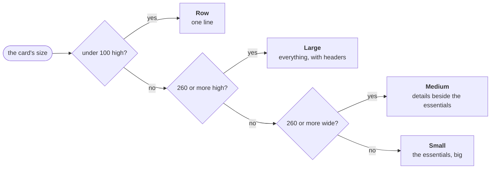

<!-- nav:start -->
[🧭 Wayfinder](../README.md) · [Using it](using.md) · **Widgets** · [Visualizer](visualizer.md) · [Make it yours](customizing.md) · [Workspaces](workspaces.md) · [Plugins](plugins.md) · [Write a widget](writing-widgets.md) · [How it works](architecture.md) · [Development](development.md)
<!-- nav:end -->

# 🧩 The widgets

Thirteen widgets come built in. Each one is a TOML file you can copy and change; see [Write a widget](writing-widgets.md).

| | Widget | What it shows | Options you can change |
|---|---|---|---|
| 🕰️ | **Analog Clock** | A round face with ticks and hands. Wide, other cities beside it; tall, as chips under it. | second hand, **smooth** sweep, ticks, cities |
| 🔢 | **Digital Clock** | The time with the date beneath, in your Windows language. Tall, other cities. | 24 h / 12 h, seconds, date, cities |
| 📅 | **Calendar** | Today and its month; weeks start on your region's first day. Large: day names and ISO week numbers. | week numbers, the months around, today's colour |
| 📊 | **System Monitor** | CPU, memory, GPUs, drives and battery: bars, then ring gauges, then a minute of history graphs. | which gauges and graphs, where, colours, warn level |
| 🎵 | **Media Controller** | Whatever plays through the Windows media controls, with a seek bar you drag. | source app, progress, cover, card |
| 🎚️ | **Audio Visualizer** | What the speakers play, live, in [eight styles](visualizer.md). | style, bands, frequencies, motion, 3D depth, sweep, colours |
| 🖼️ | **Photo Frame** | One photo at a time from a folder, crossfading every few seconds to an hour. | folder (or drop one), interval, shuffle, fit |
| 🗂️ | **Photo Gallery** | A grid of a folder's photos; an open photo gets a filmstrip, its date and size. | folder, thumbnail size, order, names |
| 🎞️ | **GIF Player** | An animated GIF, WebP or APNG, with a strip to choose from when large. Click to pause. | file or folder, fit, card |
| 🤖 | **Agent Status** | Claude Code, Copilot CLI and Antigravity CLI sessions: how many work, what each does, which just finished. | tool or all, folders, colours |
| 📋 | **Icon List** | App shortcuts that scroll; icons only when narrow, tiles when wide. | shortcuts, mirror a folder, icon size, labels |
| 📁 | **Icon Folder** | A tile with a preview that **expands in place** into an icon grid. | shortcuts, mirror a folder, columns, icon size |
| 🗄️ | **Drawer** | A collapsible drawer of app shortcuts with its own folder. | title, icon size |

<table>
<tr>
<td width="50%"></td>
<td width="50%"></td>
</tr>
<tr>
<td align="center">Clocks and launchers, rendered on Windows</td>
<td align="center">Photo Frame and Photo Gallery at different sizes</td>
</tr>
</table>

## One widget, four sizes

Drag a corner and a widget doesn't just scale: it decides what fits. The newer widgets share the same four size families, like widgets on macOS, so a layout of them stays consistent.

A widget file says this with plain conditions on its own size (`when = "{self.h >= 260}"`), so your own widgets can do the same. A narrow visualizer draws every second band, a short one drops its frequency scale, and the engine animates each change.

<!-- pager:start -->
 

---

<table width="100%"><tr><td><a href="using.md">← 🖱️ Using Wayfinder</a></td><td align="right"><a href="visualizer.md">🎚️ The audio visualizer →</a></td></tr></table>
<!-- pager:end -->
