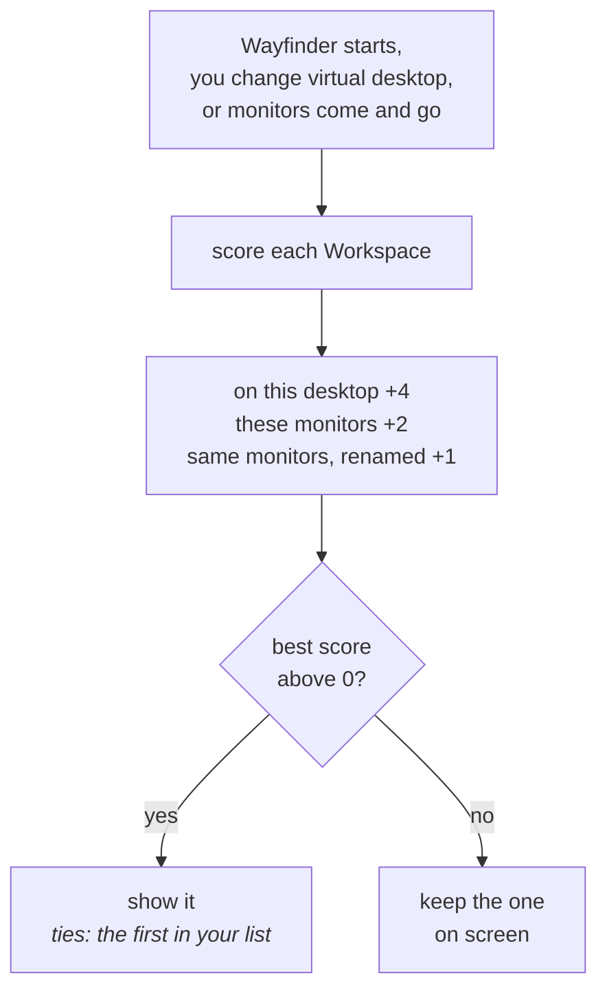

<!-- nav:start -->
[🧭 Wayfinder](../README.md) · [Using it](using.md) · [Widgets](widgets.md) · [Visualizer](visualizer.md) · [Make it yours](customizing.md) · **Workspaces** · [Plugins](plugins.md) · [Write a widget](writing-widgets.md) · [How it works](architecture.md) · [Development](development.md)
<!-- nav:end -->

# 🗂️ Workspaces

Several sets of widgets, each with its own positions, options and look, that come up by themselves.

A Workspace is a whole set of widgets with its own positions, options and look. Switch from the tray's **Workspace** menu or **Settings → Workspaces**, where you can add an empty one or duplicate the one on screen, rename and remove them, and tie one to:

- **virtual desktops** (`Win` + `Ctrl` + `D`): going to one of them brings that Workspace up;
- **a monitor setup**: connecting those monitors brings it up, so a laptop can have one set alone and another docked. A dock that renumbers its monitors still counts.

<table>
<tr>
<td width="55%"></td>
<td width="45%" valign="top">

</td>
</tr>
</table>

The most specific match wins, a Workspace with no ties only comes up when you pick it, and one you pick stays until you go to another desktop or connect other monitors. Theme and style belong to each Workspace; GPU, startup, grid and plugins are shared. Virtual desktops are read from where Explorer keeps them, as PowerToys does; see [ADR-011](adr/0011-workspaces-follow-desktops-and-monitors.md).

<!-- pager:start -->
 

---

<table width="100%"><tr><td><a href="customizing.md">← 🎨 Make it yours</a></td><td align="right"><a href="plugins.md">🧩 Plugins →</a></td></tr></table>
<!-- pager:end -->
